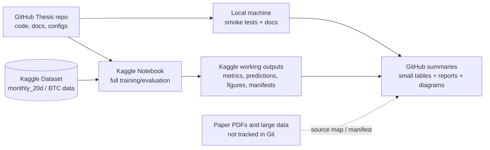
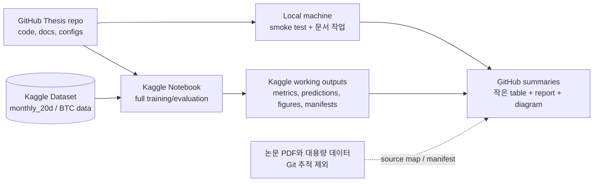

# Execution Environment Diagram

## English

```mermaid
flowchart LR
    G[GitHub Thesis repo<br/>code, docs, configs] --> L[Local machine<br/>smoke tests + docs]
    G --> K[Kaggle Notebook<br/>full training/evaluation]
    D[(Kaggle Dataset<br/>monthly_20d / BTC data)] --> K
    K --> O[Kaggle working outputs<br/>metrics, predictions, figures, manifests]
    O --> R[GitHub summaries<br/>small tables + reports + diagrams]
    L --> R

    P[Paper PDFs and large data<br/>not tracked in Git] -. source map / manifest .-> R
```

## 한국어

```mermaid
flowchart LR
    G[GitHub Thesis repo<br/>code, docs, configs] --> L[Local machine<br/>smoke test + 문서 작업]
    G --> K[Kaggle Notebook<br/>full training/evaluation]
    D[(Kaggle Dataset<br/>monthly_20d / BTC data)] --> K
    K --> O[Kaggle working outputs<br/>metrics, predictions, figures, manifests]
    O --> R[GitHub summaries<br/>작은 table + report + diagram]
    L --> R

    P[논문 PDF와 대용량 데이터<br/>Git 추적 제외] -. source map / manifest .-> R
```
