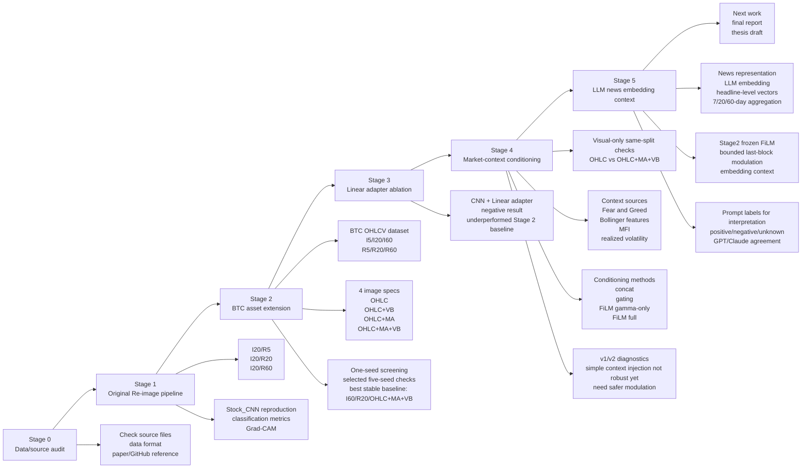
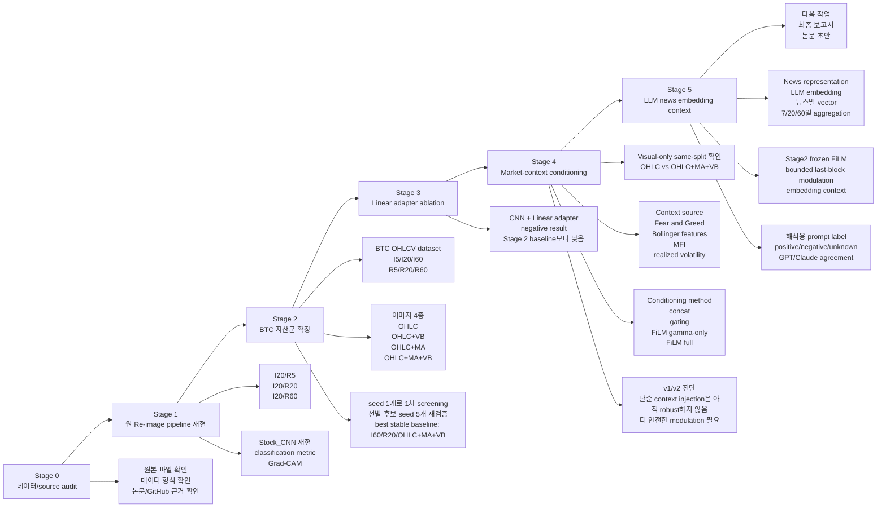

# Overall Pipeline Diagram

This file gives a compact map of the thesis experiments. Detailed metrics and run records are kept in each stage folder.

## English

```mermaid
flowchart LR
    S0[Stage 0<br/>Data/source audit]
    S1[Stage 1<br/>Original Re-image pipeline]
    S2[Stage 2<br/>BTC asset extension]
    S3[Stage 3<br/>Linear adapter ablation]
    S4[Stage 4<br/>Market-context conditioning]
    S5[Stage 5<br/>LLM news embedding context]
    NEXT[Next work<br/>final report<br/>thesis draft]

    S0 --> S1 --> S2 --> S3 --> S4 --> S5 --> NEXT

    S0 --> S0A[Check source files<br/>data format<br/>paper/GitHub reference]

    S1 --> S1A[I20/R5<br/>I20/R20<br/>I20/R60]
    S1 --> S1B[Stock_CNN reproduction<br/>classification metrics<br/>Grad-CAM]

    S2 --> S2A[BTC OHLCV dataset<br/>I5/I20/I60<br/>R5/R20/R60]
    S2 --> S2B[4 image specs<br/>OHLC<br/>OHLC+VB<br/>OHLC+MA<br/>OHLC+MA+VB]
    S2 --> S2C[One-seed screening<br/>selected five-seed checks<br/>best stable baseline: I60/R20/OHLC+MA+VB]

    S3 --> S3A[CNN + Linear adapter<br/>negative result<br/>underperformed Stage 2 baseline]

    S4 --> S4A[Visual-only same-split checks<br/>OHLC vs OHLC+MA+VB]
    S4 --> S4B[Context sources<br/>Fear and Greed<br/>Bollinger features<br/>MFI<br/>realized volatility]
    S4 --> S4C[Conditioning methods<br/>concat<br/>gating<br/>FiLM gamma-only<br/>FiLM full]
    S4 --> S4D[v1/v2 diagnostics<br/>simple context injection not robust yet<br/>need safer modulation]

    S5 --> S5A[News representation<br/>LLM embedding<br/>headline-level vectors<br/>7/20/60-day aggregation]
    S5 --> S5B[Stage2 frozen FiLM<br/>bounded last-block modulation<br/>embedding context]
    S5 --> S5C[Prompt labels for interpretation<br/>positive/negative/unknown<br/>GPT/Claude agreement]
```

## 한국어

```mermaid
flowchart LR
    S0[Stage 0<br/>데이터/source audit]
    S1[Stage 1<br/>원 Re-image pipeline 재현]
    S2[Stage 2<br/>BTC 자산군 확장]
    S3[Stage 3<br/>Linear adapter ablation]
    S4[Stage 4<br/>Market-context conditioning]
    S5[Stage 5<br/>LLM news embedding context]
    NEXT[다음 작업<br/>최종 보고서<br/>논문 초안]

    S0 --> S1 --> S2 --> S3 --> S4 --> S5 --> NEXT

    S0 --> S0A[원본 파일 확인<br/>데이터 형식 확인<br/>논문/GitHub 근거 확인]

    S1 --> S1A[I20/R5<br/>I20/R20<br/>I20/R60]
    S1 --> S1B[Stock_CNN 재현<br/>classification metric<br/>Grad-CAM]

    S2 --> S2A[BTC OHLCV dataset<br/>I5/I20/I60<br/>R5/R20/R60]
    S2 --> S2B[이미지 4종<br/>OHLC<br/>OHLC+VB<br/>OHLC+MA<br/>OHLC+MA+VB]
    S2 --> S2C[seed 1개로 1차 screening<br/>선별 후보 seed 5개 재검증<br/>best stable baseline: I60/R20/OHLC+MA+VB]

    S3 --> S3A[CNN + Linear adapter<br/>negative result<br/>Stage 2 baseline보다 낮음]

    S4 --> S4A[Visual-only same-split 확인<br/>OHLC vs OHLC+MA+VB]
    S4 --> S4B[Context source<br/>Fear and Greed<br/>Bollinger features<br/>MFI<br/>realized volatility]
    S4 --> S4C[Conditioning method<br/>concat<br/>gating<br/>FiLM gamma-only<br/>FiLM full]
    S4 --> S4D[v1/v2 진단<br/>단순 context injection은 아직 robust하지 않음<br/>더 안전한 modulation 필요]

    S5 --> S5A[News representation<br/>LLM embedding<br/>뉴스별 vector<br/>7/20/60일 aggregation]
    S5 --> S5B[Stage2 frozen FiLM<br/>bounded last-block modulation<br/>embedding context]
    S5 --> S5C[해석용 prompt label<br/>positive/negative/unknown<br/>GPT/Claude agreement]
```
