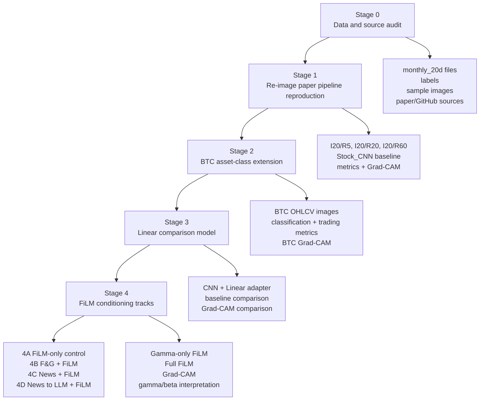
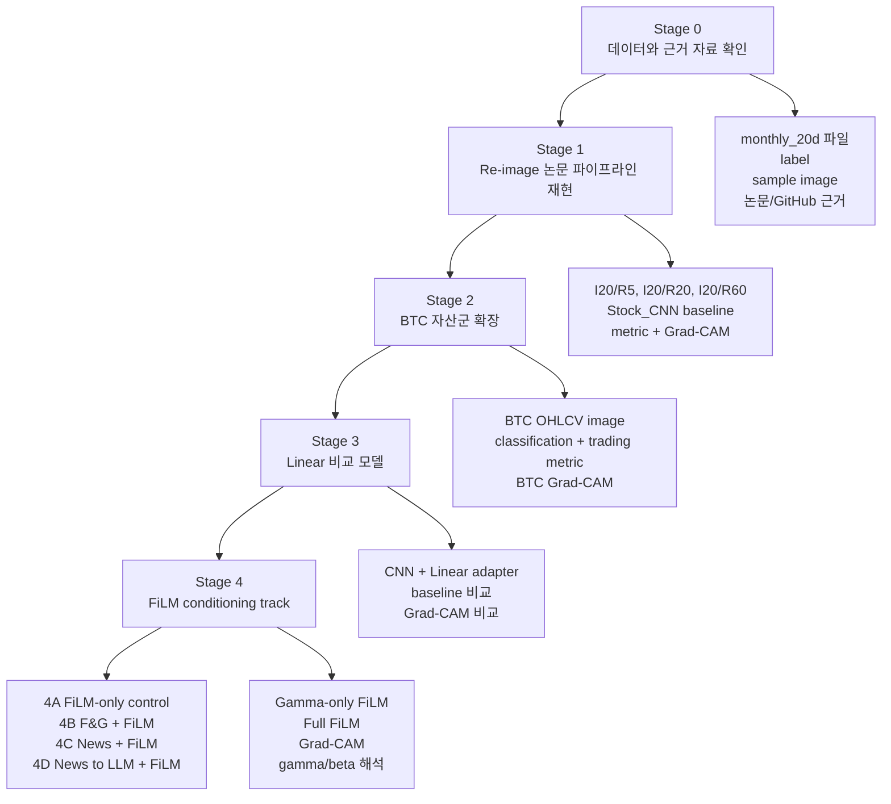

# Overall Pipeline Diagram

## English

```mermaid
flowchart TD
    A[Stage 0<br/>Data and source audit] --> B[Stage 1<br/>Re-image paper pipeline reproduction]
    B --> C[Stage 2<br/>BTC asset-class extension]
    C --> D[Stage 3<br/>Linear comparison model]
    D --> E[Stage 4<br/>FiLM conditioning tracks]

    A --> A1[monthly_20d files<br/>labels<br/>sample images<br/>paper/GitHub sources]
    B --> B1[I20/R5, I20/R20, I20/R60<br/>Stock_CNN baseline<br/>metrics + Grad-CAM]
    C --> C1[BTC OHLCV images<br/>classification + trading metrics<br/>BTC Grad-CAM]
    D --> D1[CNN + Linear adapter<br/>baseline comparison<br/>Grad-CAM comparison]
    E --> E1[4A FiLM-only control<br/>4B F&G + FiLM<br/>4C News + FiLM<br/>4D News to LLM + FiLM]
    E --> E2[Gamma-only FiLM<br/>Full FiLM<br/>Grad-CAM<br/>gamma/beta interpretation]
```

## 한국어

```mermaid
flowchart TD
    A[Stage 0<br/>데이터와 근거 자료 확인] --> B[Stage 1<br/>Re-image 논문 파이프라인 재현]
    B --> C[Stage 2<br/>BTC 자산군 확장]
    C --> D[Stage 3<br/>Linear 비교 모델]
    D --> E[Stage 4<br/>FiLM conditioning track]

    A --> A1[monthly_20d 파일<br/>label<br/>sample image<br/>논문/GitHub 근거]
    B --> B1[I20/R5, I20/R20, I20/R60<br/>Stock_CNN baseline<br/>metric + Grad-CAM]
    C --> C1[BTC OHLCV image<br/>classification + trading metric<br/>BTC Grad-CAM]
    D --> D1[CNN + Linear adapter<br/>baseline 비교<br/>Grad-CAM 비교]
    E --> E1[4A FiLM-only control<br/>4B F&G + FiLM<br/>4C News + FiLM<br/>4D News to LLM + FiLM]
    E --> E2[Gamma-only FiLM<br/>Full FiLM<br/>Grad-CAM<br/>gamma/beta 해석]
```
