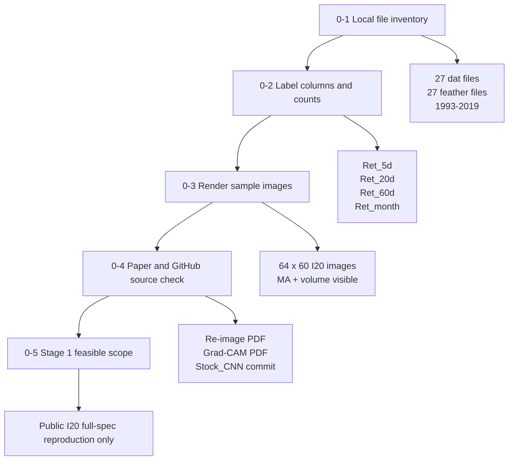
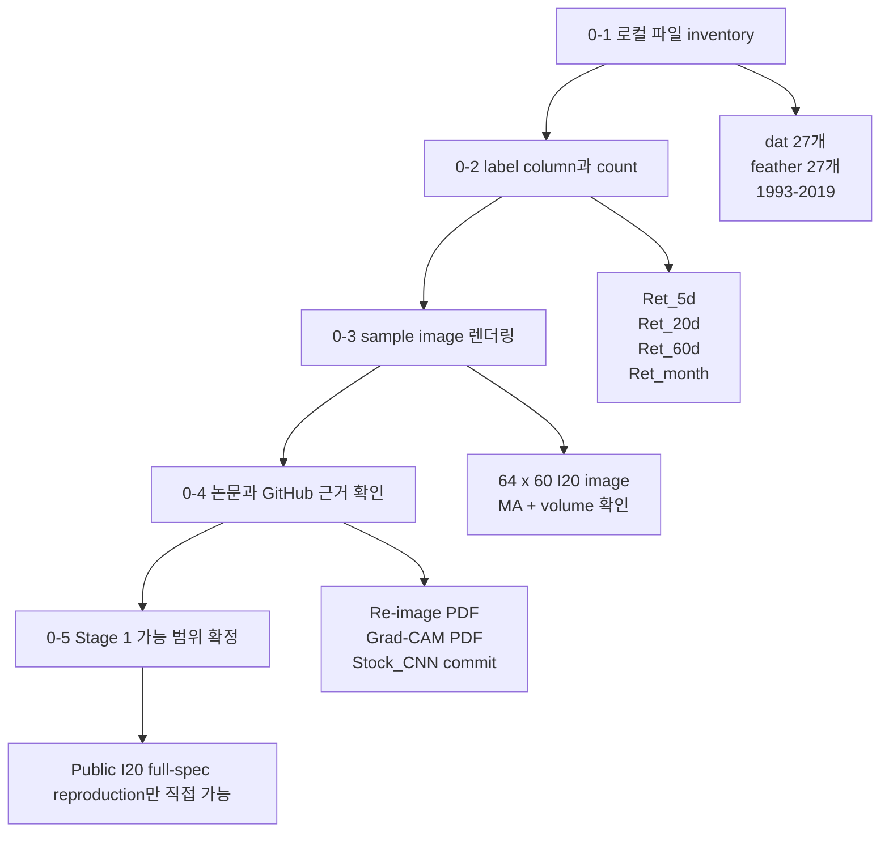

# Stage 0 Workflow Diagram

## English

```mermaid
flowchart TD
    A[0-1 Local file inventory] --> B[0-2 Label columns and counts]
    B --> C[0-3 Render sample images]
    C --> D[0-4 Paper and GitHub source check]
    D --> E[0-5 Stage 1 feasible scope]

    A --> A1[27 dat files<br/>27 feather files<br/>1993-2019]
    B --> B1[Ret_5d<br/>Ret_20d<br/>Ret_60d<br/>Ret_month]
    C --> C1[64 x 60 I20 images<br/>MA + volume visible]
    D --> D1[Re-image PDF<br/>Grad-CAM PDF<br/>Stock_CNN commit]
    E --> E1[Public I20 full-spec reproduction only]
```

## 한국어

```mermaid
flowchart TD
    A[0-1 로컬 파일 inventory] --> B[0-2 label column과 count]
    B --> C[0-3 sample image 렌더링]
    C --> D[0-4 논문과 GitHub 근거 확인]
    D --> E[0-5 Stage 1 가능 범위 확정]

    A --> A1[dat 27개<br/>feather 27개<br/>1993-2019]
    B --> B1[Ret_5d<br/>Ret_20d<br/>Ret_60d<br/>Ret_month]
    C --> C1[64 x 60 I20 image<br/>MA + volume 확인]
    D --> D1[Re-image PDF<br/>Grad-CAM PDF<br/>Stock_CNN commit]
    E --> E1[Public I20 full-spec reproduction만 직접 가능]
```
