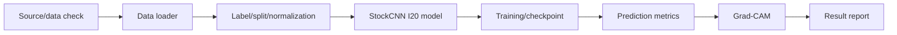

# Stage 1: Re-image Reproduction

Stage 1은 원 논문 *Re-Imag(in)ing Price Trends*의 I20 chart-image CNN 파이프라인을 먼저 재현하는 단계입니다. 이 단계의 목적은 이후 BTC 확장(Stage 2)과 FiLM 실험(Stage 4)의 기준이 되는 baseline pipeline을 고정하는 것입니다.

## Goal

- 공개 `monthly_20d` stock chart image shard를 사용합니다.
- 가능한 horizon인 `I20/R5`, `I20/R20`, `I20/R60`을 실행합니다.
- `lich99/Stock_CNN`의 I20 CNN 구조를 기준으로 구현합니다.
- classification metric과 Figure-13-style Grad-CAM 결과를 저장합니다.

## Workflow



## Checklist And Review Links

| Step group | Purpose | Link |
| --- | --- | --- |
| Planning checklist | Goal-to-task workflow | [checklist.md](checklist.md) |
| Stage execution map | End-to-end execution map | [docs/stage1_execution_map.md](docs/stage1_execution_map.md) |
| Pipeline detail | Data/model/evaluation flow | [docs/stage1_pipeline.md](docs/stage1_pipeline.md) |
| Current Kaggle output review | Current preserved result status | [checklist_results/1-I10_current_kaggle_output_status.md](checklist_results/1-I10_current_kaggle_output_status.md) |
| Final status report | Main Stage 1 result summary | [reports/stage1_current_status_report.md](reports/stage1_current_status_report.md) |

## Current Results

| Experiment | Split | Samples | Accuracy | Majority | ROC-AUC | Output status |
| --- | --- | ---: | ---: | ---: | ---: | --- |
| `I20/R5` | test | 1,399,933 | 0.5273 | 0.5078 | 0.5373 | completed |
| `I20/R20` | test | 1,393,845 | 0.5285 | 0.5222 | 0.5339 | completed |
| `I20/R60` | test | 1,376,215 | 0.5312 | 0.5408 | 0.5298 | completed |

Result files:
- [Stage 1 current status report](reports/stage1_current_status_report.md)
- [Stage 1 seed-42 result CSV](reports/tables/stage1_seed42_current_status.csv)
- [Stage 1 horizon count by period](reports/tables/stage1_horizon_counts_by_period.csv)
- [Stage 1 horizon count by year](reports/tables/stage1_horizon_counts_by_year.csv)

Grad-CAM preview:


## Code Map

| Area | Location | Role |
| --- | --- | --- |
| Config | [configs/](configs/) | Local/Kaggle path and runtime settings |
| Data loading | [src/stage1_reimage/data/](src/stage1_reimage/data/) | Public `monthly_20d` image/label shard loading |
| Model | [src/stage1_reimage/models/](src/stage1_reimage/models/) | Stock_CNN-style I20 baseline |
| Training | [src/stage1_reimage/training/](src/stage1_reimage/training/) | Training loop, checkpoint, early stopping |
| Evaluation | [src/stage1_reimage/evaluation/](src/stage1_reimage/evaluation/) | Prediction and metric export |
| Interpretability | [src/stage1_reimage/interpretability/](src/stage1_reimage/interpretability/) | Grad-CAM generation |
| Runners | [scripts/](scripts/) | CLI checks, training, evaluation, Grad-CAM |
| Kaggle cell | [notebooks/kaggle_stage1_single_horizon_one_cell.md](notebooks/kaggle_stage1_single_horizon_one_cell.md) | Full Kaggle execution cell |

## Folder Structure

```text
stage1_reimage_reproduction/
├── checklist.md              # task checklist
├── checklist_results/        # per-step review notes
├── configs/                  # local/Kaggle configs
├── docs/                     # design and workflow docs
├── notebooks/                # Kaggle one-cell runners
├── reports/                  # result reports, smoke logs, tables, figures
├── scripts/                  # executable CLI scripts
└── src/stage1_reimage/       # shared Python package
```

## Notes

- Stage 1 uses stock chart images supplied by the public dataset, not generated BTC images.
- Stage 1 supports only the public I20 full-spec image setting available in the dataset.
- Stage 2 starts from this verified pipeline and changes the asset universe to BTC.
