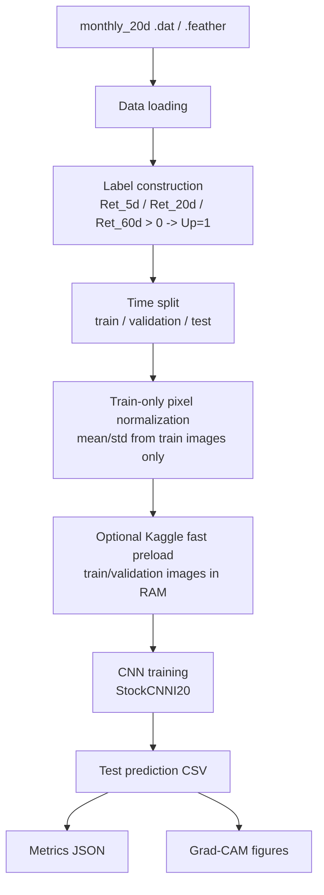
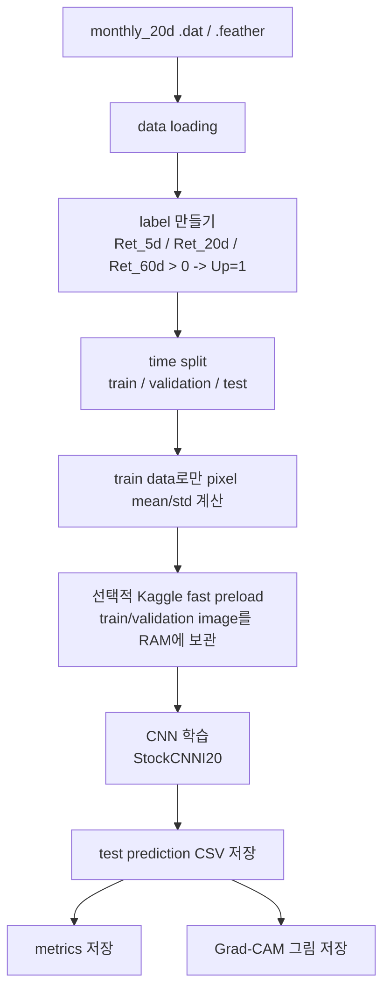

# Stage 1 Execution Map

## English

This is the canonical Stage 1 GitHub map. It shows the Re-image reproduction
pipeline, links each step to the code that implements it, and defines the
Stage 1 Kaggle output checklist.

Canonical Kaggle interface:
- [Kaggle one-cell runner](../notebooks/kaggle_stage1_single_horizon_one_cell.md)

The one-cell runner is only the Kaggle execution interface. The actual thesis
pipeline remains in the modular code under [src/stage1_reimage](../src/stage1_reimage).

### Pipeline Diagram

### Code Links

| Pipeline step | Main code | Notes |
| --- | --- | --- |
| `monthly_20d .dat/.feather` | [env_kaggle.yaml](../configs/env_kaggle.yaml) | Kaggle path and runtime config. |
| data loading | [monthly20.py](../src/stage1_reimage/data/monthly20.py) | Discovers `.dat`/`.feather` shards and reads image rows as `(1, 64, 60)`. |
| label construction | [label_split.py](../src/stage1_reimage/data/label_split.py) | Builds `label = 1` when future return is positive. |
| time split | [label_split.py](../src/stage1_reimage/data/label_split.py) | Assigns train, validation, and test split. |
| train-only pixel mean/std | [label_split.py](../src/stage1_reimage/data/label_split.py) | Computes normalization using train images only. |
| optional Kaggle fast preload | [label_split.py](../src/stage1_reimage/data/label_split.py) | `PreloadedHorizonSplitImageDataset` keeps train/validation images in RAM to avoid random memmap I/O. |
| CNN model | [stock_cnn.py](../src/stage1_reimage/models/stock_cnn.py) | GitHub-style I20 CNN following `lich99/Stock_CNN`. |
| CNN training | [loop.py](../src/stage1_reimage/training/loop.py) | Cross-entropy, Adam, early stopping, AMP/DataParallel options, checkpoint writing. |
| training runner | [stage1_baseline.py](../src/stage1_reimage/runners/stage1_baseline.py) | Orchestrates data, labels, splits, normalization, loaders, and training. |
| training CLI | [run_stage1_baseline.py](../scripts/run_stage1_baseline.py) | Called by the Kaggle one-cell runner. |
| test prediction CSV | [prediction.py](../src/stage1_reimage/evaluation/prediction.py) | Loads `best.pt`, writes prediction CSV, computes probabilities. |
| evaluation CLI | [evaluate_stage1_predictions.py](../scripts/evaluate_stage1_predictions.py) | Exports test predictions and metrics. |
| metrics JSON | [prediction.py](../src/stage1_reimage/evaluation/prediction.py) | Accuracy, precision, recall, F1, AUC, Brier score, correlations. |
| Grad-CAM figures | [gradcam.py](../src/stage1_reimage/interpretability/gradcam.py) | Re-image Figure 13-style class-discriminative heatmaps. |
| Grad-CAM CLI | [generate_stage1_gradcam.py](../scripts/generate_stage1_gradcam.py) | Selects Up/Down samples and writes heatmap grids. |
| output check | [check_stage1_single_seed_outputs.py](../scripts/check_stage1_single_seed_outputs.py) | Verifies checkpoint, prediction, metric, manifest, and Grad-CAM files. |

### Stage 1 Final Output Checklist

The Stage 1 Kaggle run is complete only after these outputs exist:

1. `I20/R5` test prediction
2. `I20/R20` test prediction
3. `I20/R60` test prediction
4. `I20/R5` Grad-CAM
5. `I20/R20` Grad-CAM
6. `I20/R60` Grad-CAM
7. output check

Expected output paths:

| Output | Expected path pattern |
| --- | --- |
| test prediction | `outputs/predictions/<horizon>/seed_42/test_predictions.csv` |
| metrics | `outputs/metrics/<horizon>/seed_42/test_metrics.json` |
| correlation metrics | `outputs/metrics/<horizon>/seed_42/test_correlation_metrics.json` |
| checkpoint | `outputs/checkpoints/<horizon>/seed_42/best.pt` |
| Grad-CAM figure | `outputs/figures/gradcam/<horizon>/seed_42/test/figure13_style_2019_test.png` |
| run manifest | `outputs/run_manifests/run_manifest.json` |

## 한국어

이 문서는 Stage 1 GitHub 기준 지도입니다. Re-image 재현 파이프라인을 다이어그램으로
보여주고, 각 단계가 어떤 코드와 연결되는지, Stage 1 Kaggle 최종 산출물이 무엇인지
고정합니다.

표준 Kaggle 실행 interface:
- [Kaggle one-cell runner](../notebooks/kaggle_stage1_single_horizon_one_cell.md)

one-cell runner는 Kaggle 실행 interface일 뿐입니다. 실제 논문 파이프라인 구현은
[src/stage1_reimage](../src/stage1_reimage) 아래 modular code에 있습니다.

### 파이프라인 다이어그램

### 코드 링크

| 파이프라인 단계 | 주요 코드 | 설명 |
| --- | --- | --- |
| `monthly_20d .dat/.feather` | [env_kaggle.yaml](../configs/env_kaggle.yaml) | Kaggle path와 runtime config. |
| data loading | [monthly20.py](../src/stage1_reimage/data/monthly20.py) | `.dat`/`.feather` shard를 찾고 image row를 `(1, 64, 60)`으로 읽습니다. |
| label 만들기 | [label_split.py](../src/stage1_reimage/data/label_split.py) | future return이 양수이면 `label=1`을 만듭니다. |
| time split | [label_split.py](../src/stage1_reimage/data/label_split.py) | train, validation, test split을 부여합니다. |
| train-only pixel mean/std | [label_split.py](../src/stage1_reimage/data/label_split.py) | train image만 사용해 normalization mean/std를 계산합니다. |
| 선택적 Kaggle fast preload | [label_split.py](../src/stage1_reimage/data/label_split.py) | `PreloadedHorizonSplitImageDataset`이 train/validation image를 RAM에 올려 random memmap I/O를 줄입니다. |
| CNN model | [stock_cnn.py](../src/stage1_reimage/models/stock_cnn.py) | `lich99/Stock_CNN`을 따르는 I20 CNN입니다. |
| CNN 학습 | [loop.py](../src/stage1_reimage/training/loop.py) | Cross-entropy, Adam, early stopping, AMP/DataParallel option, checkpoint 저장. |
| training runner | [stage1_baseline.py](../src/stage1_reimage/runners/stage1_baseline.py) | data, label, split, normalization, loader, training을 연결합니다. |
| training CLI | [run_stage1_baseline.py](../scripts/run_stage1_baseline.py) | Kaggle one-cell runner가 호출합니다. |
| test prediction CSV | [prediction.py](../src/stage1_reimage/evaluation/prediction.py) | `best.pt`를 불러와 prediction CSV와 probability를 저장합니다. |
| evaluation CLI | [evaluate_stage1_predictions.py](../scripts/evaluate_stage1_predictions.py) | test prediction과 metric을 export합니다. |
| metrics 저장 | [prediction.py](../src/stage1_reimage/evaluation/prediction.py) | Accuracy, precision, recall, F1, AUC, Brier score, correlation을 계산합니다. |
| Grad-CAM 그림 | [gradcam.py](../src/stage1_reimage/interpretability/gradcam.py) | Re-image Figure 13 스타일 class-discriminative heatmap입니다. |
| Grad-CAM CLI | [generate_stage1_gradcam.py](../scripts/generate_stage1_gradcam.py) | Up/Down sample을 고르고 heatmap grid를 저장합니다. |
| output check | [check_stage1_single_seed_outputs.py](../scripts/check_stage1_single_seed_outputs.py) | checkpoint, prediction, metric, manifest, Grad-CAM 파일 존재를 확인합니다. |

### Stage 1 최종 산출물 체크리스트

Stage 1 Kaggle run은 아래 산출물이 있어야 완료입니다.

1. `I20/R5` test prediction
2. `I20/R20` test prediction
3. `I20/R60` test prediction
4. `I20/R5` Grad-CAM
5. `I20/R20` Grad-CAM
6. `I20/R60` Grad-CAM
7. output check

예상 output path:

| 산출물 | 예상 path pattern |
| --- | --- |
| test prediction | `outputs/predictions/<horizon>/seed_42/test_predictions.csv` |
| metrics | `outputs/metrics/<horizon>/seed_42/test_metrics.json` |
| correlation metrics | `outputs/metrics/<horizon>/seed_42/test_correlation_metrics.json` |
| checkpoint | `outputs/checkpoints/<horizon>/seed_42/best.pt` |
| Grad-CAM figure | `outputs/figures/gradcam/<horizon>/seed_42/test/figure13_style_2019_test.png` |
| run manifest | `outputs/run_manifests/run_manifest.json` |
