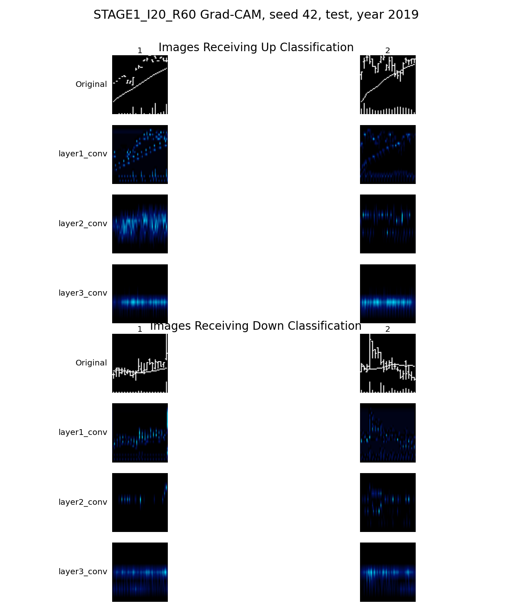
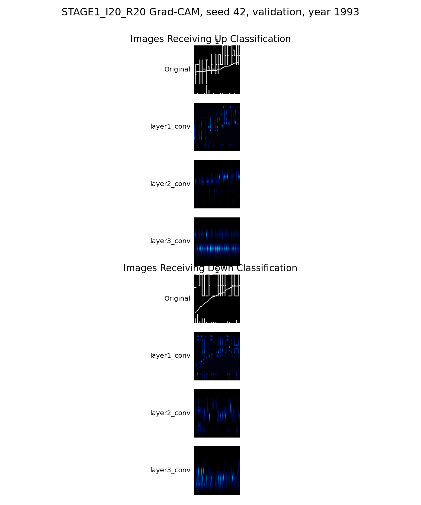

# Stage 1 Current Kaggle Output Status

## English

Status date: 2026-05-01

Stage 1 is still in progress. The implementation and Kaggle runner are ready,
but the locally archived Kaggle outputs are incomplete across the three target
horizons.

| Experiment | Current artifact status | Split | Samples | Accuracy | Majority accuracy | ROC-AUC | Notes |
|:---|:---|:---|---:|---:|---:|---:|:---|
| `I20/R5` | Pending | - | - | - | - | - | No full Kaggle output is currently archived locally. |
| `I20/R20` | Smoke validation only | validation | 4 | 0.2500 | 0.5000 | 0.5000 | This is not a reproduction result. The folder currently preserves a tiny local smoke output only. |
| `I20/R60` | Full single-seed fast diagnostic | test | 1,376,215 | 0.5312 | 0.5408 | 0.5298 | Seed `42` full test artifact is archived, but it used fast Kaggle settings. |

Important interpretation:
- `I20/R60` is the only current Stage 1 full test artifact available locally.
- `I20/R20` has a folder/checkpoint artifact from the local smoke path, but the
  metrics and Grad-CAM that are currently preserved are validation-smoke
  outputs. Do not report it as the full `I20/R20` reproduction result.
- `I20/R5` must still be re-run or re-downloaded.
- Strict paper-style settings remain later work: batch size `128` and five
  independent runs/seeds.
- The current `I20/R60` Grad-CAM preview uses `2` predicted-up and `2`
  predicted-down samples. The final Figure-13-style output should use `10` up
  and `10` down samples.

Current result table:
- [Stage 1 seed-42 current status CSV](tables/stage1_seed42_current_status.csv)

Current `I20/R60` Grad-CAM preview:

Smoke-only `I20/R20` Grad-CAM artifact:

## 한국어

상태 기준일: 2026-05-01

Stage 1은 아직 진행 중입니다. 구현과 Kaggle runner는 준비됐지만, 로컬에
보존된 Kaggle output은 세 horizon 전체가 완성된 상태가 아닙니다.

| 실험 | 현재 artifact 상태 | Split | Sample 수 | Accuracy | Majority accuracy | ROC-AUC | 비고 |
|:---|:---|:---|---:|---:|---:|---:|:---|
| `I20/R5` | 대기 | - | - | - | - | - | 현재 로컬에 full Kaggle output이 보존되어 있지 않습니다. |
| `I20/R20` | Smoke validation only | validation | 4 | 0.2500 | 0.5000 | 0.5000 | 재현 결과가 아닙니다. 현재 폴더에 남은 것은 작은 local smoke output입니다. |
| `I20/R60` | Full single-seed fast diagnostic | test | 1,376,215 | 0.5312 | 0.5408 | 0.5298 | Seed `42` full test artifact는 보존되어 있지만 fast Kaggle setting을 사용했습니다. |

중요 해석:
- 현재 Stage 1에서 로컬에 보존된 full test artifact는 `I20/R60`뿐입니다.
- `I20/R20`은 local smoke path에서 생긴 폴더와 checkpoint artifact가 있지만,
  현재 보존된 metrics와 Grad-CAM은 validation smoke output입니다. full
  `I20/R20` 재현 결과로 보고하면 안 됩니다.
- `I20/R5`는 아직 다시 실행하거나 Kaggle 결과를 다시 내려받아야 합니다.
- 논문식 strict setting은 나중에 수행합니다: batch size `128`, five
  independent runs/seeds.
- 현재 `I20/R60` Grad-CAM preview는 predicted-up 2개와 predicted-down 2개만
  포함합니다. 최종 Figure 13 스타일 산출물은 up 10개, down 10개로 다시
  만들어야 합니다.

현재 결과표:
- [Stage 1 seed-42 current status CSV](tables/stage1_seed42_current_status.csv)

현재 `I20/R60` Grad-CAM preview:

Smoke-only `I20/R20` Grad-CAM artifact:

