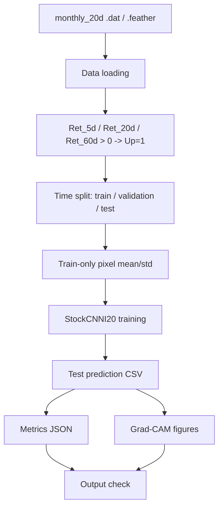
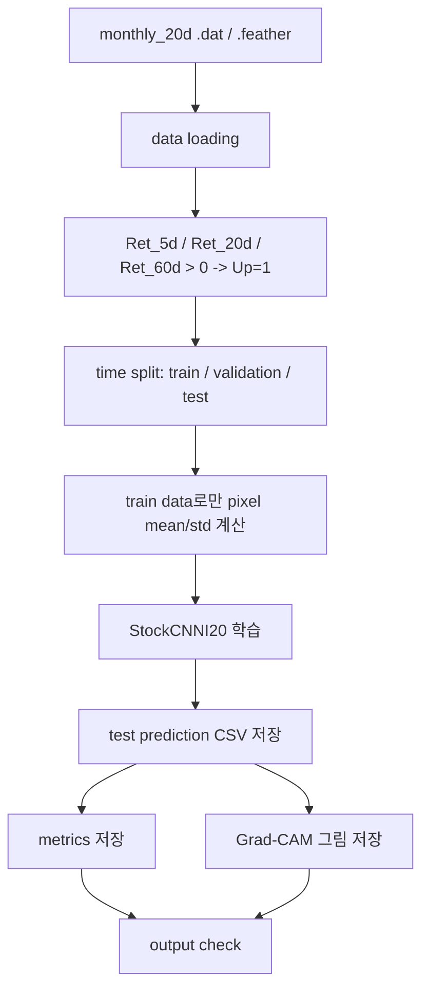

# Stage 1 Workflow Diagram

## English

Canonical detailed map:
- [docs/stage1_execution_map.md](docs/stage1_execution_map.md)

## 한국어

상세 기준 문서:
- [docs/stage1_execution_map.md](docs/stage1_execution_map.md)

