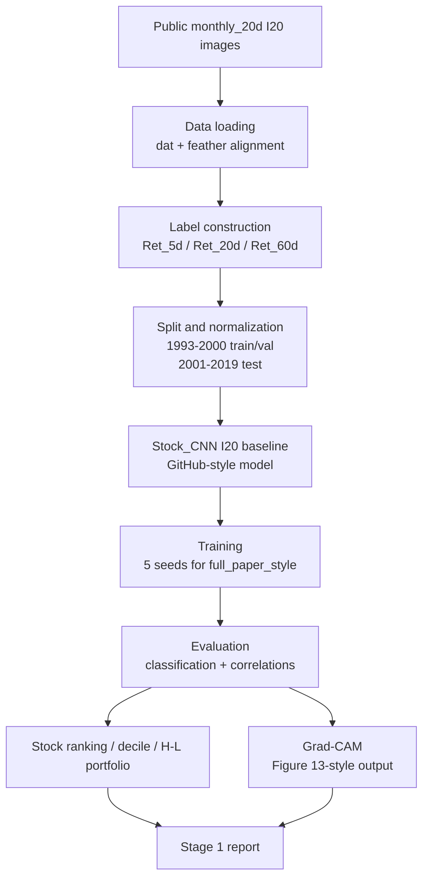
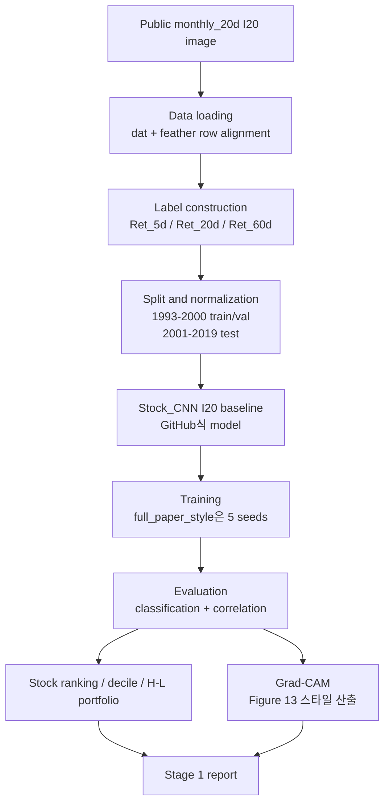

# Stage 1 Workflow Diagram

## English

```mermaid
flowchart TD
    A[Public monthly_20d I20 images] --> B[Data loading<br/>dat + feather alignment]
    B --> C[Label construction<br/>Ret_5d / Ret_20d / Ret_60d]
    C --> D[Split and normalization<br/>1993-2000 train/val<br/>2001-2019 test]
    D --> E[Stock_CNN I20 baseline<br/>GitHub-style model]
    E --> F[Training<br/>5 seeds for full_paper_style]
    F --> G[Evaluation<br/>classification + correlations]
    G --> H[Stock ranking / decile / H-L portfolio]
    G --> I[Grad-CAM<br/>Figure 13-style output]
    H --> J[Stage 1 report]
    I --> J
```

## 한국어

```mermaid
flowchart TD
    A[Public monthly_20d I20 image] --> B[Data loading<br/>dat + feather row alignment]
    B --> C[Label construction<br/>Ret_5d / Ret_20d / Ret_60d]
    C --> D[Split and normalization<br/>1993-2000 train/val<br/>2001-2019 test]
    D --> E[Stock_CNN I20 baseline<br/>GitHub식 model]
    E --> F[Training<br/>full_paper_style은 5 seeds]
    F --> G[Evaluation<br/>classification + correlation]
    G --> H[Stock ranking / decile / H-L portfolio]
    G --> I[Grad-CAM<br/>Figure 13 스타일 산출]
    H --> J[Stage 1 report]
    I --> J
```
