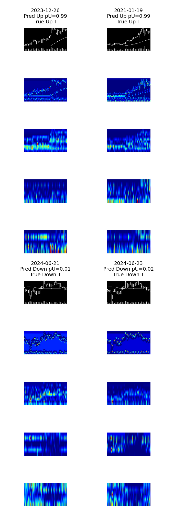

# Stage 2: BTC Asset-Class Extension

Stage 2는 Stage 1에서 확인한 Re-image/Stock_CNN-style chart-image CNN 파이프라인을 BTC 단일 자산으로 옮기는 단계입니다. 핵심은 모델 실험을 새로 복잡하게 만드는 것이 아니라, 자산군을 BTC로 바꿨을 때 어떤 image window, return horizon, image specification이 유효한지 선별하는 것입니다.

## Goal

- Stage 1의 chart-image CNN pipeline을 유지합니다.
- Stock image shard 대신 BTC OHLCV에서 chart image를 직접 생성합니다.
- `I5/I20/I60 x R5/R20/R60 x 4 image specs`를 seed 1개로 1차 screening합니다.
- 효과가 있던 후보를 seed 5개로 재검증합니다.
- Stage 4의 primary visual baseline을 결정합니다.

## Workflow

```mermaid
flowchart LR
    A[BTC OHLCV audit] --> B[Chart image generation]
    B --> C[Label/split/normalization]
    C --> D[I5/I20/I60 StockCNN variants]
    D --> E[One-seed grid screening]
    E --> F[Selected five-seed robustness check]
    F --> G[Classification + trading metrics]
    G --> H[Grad-CAM + result report]
    H --> I[Stage 4 baseline selection]
```



## Checklist And Review Links

| Step group | Purpose | Link |
| --- | --- | --- |
| Planning checklist | Goal-to-task workflow | [checklist.md](checklist.md) |
| Pipeline detail | BTC data/image/model/eval flow | [docs/stage2_pipeline.md](docs/stage2_pipeline.md) |
| Data audit | BTC OHLCV source quality check | [reports/data_audit/btc_ohlcv_audit.md](reports/data_audit/btc_ohlcv_audit.md) |
| Grid runner review | Single-seed/five-seed runner setup | [checklist_results/2-I11_stage2_grid_runners_and_viewer.md](checklist_results/2-I11_stage2_grid_runners_and_viewer.md) |
| Single-seed result report | Full 36-run screening result | [reports/stage2_single_seed_result_report.md](reports/stage2_single_seed_result_report.md) |
| Selected five-seed report | Robustness check result | [reports/stage2_i20_i60_r20_five_seed_result_report.md](reports/stage2_i20_i60_r20_five_seed_result_report.md) |

## Experiment Matrix

| Axis | Values |
| --- | --- |
| Image window/model | `I5`, `I20`, `I60` |
| Return horizon | `R5`, `R20`, `R60` |
| Image spec | `ohlc`, `ohlc_vb`, `ohlc_ma`, `ohlc_ma_vb` |
| First pass | 36 runs, seed `42` |
| Robustness pass | selected `I20/R20` and `I60/R20` candidates, seeds `42-46` |

## Current Results

Primary Stage 2 baseline selected for Stage 4:

`I60 / R20 / ohlc_ma_vb`

| Image window | Return horizon | Image spec | Accuracy mean | Accuracy std | ROC-AUC mean | ROC-AUC std |
| ---: | ---: | --- | ---: | ---: | ---: | ---: |
| 60 | 20 | `ohlc_ma_vb` | 0.5793 | 0.0182 | 0.5849 | 0.0233 |

Key interpretation:
- `I60/R20` is the strongest and most stable family in the current selected checks.
- `ohlc_ma_vb` is the current main visual baseline because it combines the best window/horizon with MA and volume information.
- `I5` was not expanded to five seeds because the single-seed screening was weak.
- Full 180-run five-seed expansion remains unnecessary for the current Stage 4 direction unless a broader Stage 2 stability claim is needed later.

Main result tables:
- [Single-seed seed-level results](reports/tables/stage2_single_seed_seed_level_results.csv)
- [Single-seed summary sorted by accuracy](reports/tables/stage2_single_seed_summary_sorted_by_accuracy.csv)
- [Selected five-seed seed results](reports/tables/stage2_i20_i60_r20_five_seed_seed_results.csv)
- [Selected five-seed mean/std results](reports/tables/stage2_i20_i60_r20_five_seed_mean_std_results.csv)

Grad-CAM:
- [Stage 2 best Grad-CAM 10-sample Kaggle cell](notebooks/kaggle_stage2_best_gradcam_10_one_cell.md)
- Preview figure: 

## Code Map

| Area | Location | Role |
| --- | --- | --- |
| Config | [configs/](configs/) | Local/Kaggle path and runtime settings |
| BTC data | [src/stage2_btc/data/](src/stage2_btc/data/) | OHLCV loading, sample construction, labels/splits |
| Imaging | [src/stage2_btc/imaging/](src/stage2_btc/imaging/) | BTC chart image rendering |
| Models | [src/stage2_btc/models/](src/stage2_btc/models/) | I5/I20/I60 Stock_CNN variants |
| Training | [src/stage2_btc/training/](src/stage2_btc/training/) | Training loop and checkpointing |
| Evaluation | [src/stage2_btc/evaluation/](src/stage2_btc/evaluation/) | Classification and trading metrics |
| Interpretability | [src/stage2_btc/interpretability/](src/stage2_btc/interpretability/) | BTC Grad-CAM |
| Runners | [scripts/](scripts/) | Audit, train, evaluate, grid, summarize |
| Kaggle cells | [notebooks/](notebooks/) | One-cell execution notebooks |

## Folder Structure

```text
stage2_btc_extension/
├── checklist.md
├── checklist_results/
├── configs/
├── docs/
├── notebooks/
├── reports/
├── scripts/
└── src/stage2_btc/
```

## Stage 4 Dependency

Stage 4 uses `I60/R20/ohlc_ma_vb` as the main visual baseline. The Stage 4 question is therefore not “does the chart CNN work?”, but “can market context improve or explain this already strong BTC chart-image baseline?”
