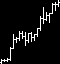
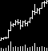
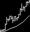
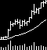

# Stage 2: BTC Asset-Class Extension

## English

This folder is reserved for Stage 2 of the thesis pipeline.

Stage 2 objective:
- Keep the confirmed Re-image/Stock_CNN-style image CNN pipeline from Stage 1.
- Change the asset universe from public stock image shards to BTC OHLCV.
- Generate BTC chart images directly from raw OHLCV.
- Evaluate the BTC single-asset setting with both classification metrics and
  time-series trading metrics.
- Produce BTC Grad-CAM figures for every baseline run.

Current boundary:
- Stage 2 can start while Stage 1 Kaggle full runs are still running.
- Stage 2 final comparison and report must wait until Stage 1 full outputs are
  available.
- Stage 2 should use the paper batch size `128` by default because BTC has many
  fewer samples than the public stock shard.

Primary data:
- BTC OHLCV: `kaggle.com/datasets/novandraanugrah/bitcoin-historical-datasets-2018-2024`

Main documents:
- [Checklist](checklist.md)
- [Workflow diagram](workflow_diagram.md)
- [Stage 2 pipeline](docs/stage2_pipeline.md)
- [BTC image generation plan](docs/stage2_image_generation_plan.md)
- [BTC label/split/normalization plan](docs/stage2_label_split_normalization_plan.md)
- [BTC baseline CNN adaptation plan](docs/stage2_baseline_cnn_adaptation_plan.md)
- [BTC evaluation and trading metric plan](docs/stage2_evaluation_trading_metric_plan.md)
- [BTC Grad-CAM plan](docs/stage2_gradcam_plan.md)
- [Kaggle runner and output plan](docs/stage2_kaggle_runner_output_plan.md)
- [Implementation readiness review](docs/stage2_implementation_readiness_review.md)
- [Source map](docs/source_map.md)

### Results

Current result status:
- Completed run: single seed `42`
- Grid size: `36` experiments
  (`3` image windows x `3` return horizons x `4` image specs)
- Full five-seed stability check is still pending.

Full result report:
- [Stage 2 single-seed result report](reports/stage2_single_seed_result_report.md)

#### Experiment Design

Stage 2 keeps the Stage 1 image-CNN pipeline and changes the asset universe to
BTC. Each sample uses one BTC chart image ending at date `t`; the label is
whether the future `R`-day return is positive.

Image specifications:

| Image spec | Contents | BTC sample image |
|:---|:---|:---|
| `ohlc` | OHLC chart only |  |
| `ohlc_vb` | OHLC + volume bars |  |
| `ohlc_ma` | OHLC + moving average |  |
| `ohlc_ma_vb` | OHLC + moving average + volume bars |  |

Comparison axes:

| Axis | Compared values | Purpose |
|:---|:---|:---|
| Image window/model | `I5`, `I20`, `I60` | Compare short, medium, and longer chart history |
| Return horizon | `R5`, `R20`, `R60` | Compare three future prediction intervals |
| Image specification | `ohlc`, `ohlc_vb`, `ohlc_ma`, `ohlc_ma_vb` | Test whether MA and volume add information |

#### Comparison Summary

Average by image window:

| Image window | Accuracy | AUC | Accuracy - majority | Interpretation |
|---:|---:|---:|---:|:---|
| 5 | 0.5140 | 0.5075 | -0.0229 | Weakest on average |
| 20 | 0.5173 | 0.5120 | -0.0196 | Slightly better than I5, still weak |
| 60 | 0.5439 | 0.5323 | +0.0071 | Best average window |

Average by return horizon:

| Return horizon | Accuracy | AUC | Accuracy - majority | Interpretation |
|---:|---:|---:|---:|:---|
| 5 | 0.5157 | 0.5094 | -0.0104 | Short horizon is noisy |
| 20 | 0.5427 | 0.5277 | +0.0014 | Best average prediction horizon |
| 60 | 0.5167 | 0.5147 | -0.0265 | Classification signal is weaker |

Average by image specification:

| Image spec | Accuracy | AUC | Accuracy - majority | Interpretation |
|:---|---:|---:|---:|:---|
| `ohlc` | 0.5183 | 0.5010 | -0.0186 | Chart-only signal is weak |
| `ohlc_vb` | 0.5303 | 0.5201 | -0.0066 | Best average accuracy |
| `ohlc_ma` | 0.5253 | 0.5167 | -0.0116 | MA helps somewhat |
| `ohlc_ma_vb` | 0.5263 | 0.5312 | -0.0105 | Best average AUC and best individual run |

Top accuracy configurations:

| Tier | Image window | Return horizon | Image spec | Accuracy | AUC | Accuracy - majority | Interpretation |
|:---|---:|---:|:---|---:|---:|---:|:---|
| Best | 60 | 20 | `ohlc_ma_vb` | 0.6031 | 0.6169 | +0.0618 | Strongest single-seed result |
| Promising | 60 | 20 | `ohlc_vb` | 0.5947 | 0.5828 | +0.0534 | Strong alternative without MA |
| Promising | 60 | 20 | `ohlc_ma` | 0.5711 | 0.5608 | +0.0298 | MA helps, but volume adds more |
| Caution | 20 | 20 | `ohlc_vb` | 0.5455 | 0.5309 | +0.0042 | Slightly above majority only |
| Caution | 60 | 60 | `ohlc` | 0.5432 | 0.4891 | +0.0000 | Trading metric is high, but AUC is weak |

Main interpretation:
- The clearest signal is concentrated in the `I60/R20` group.
- The best single run is `I60/R20/ohlc_ma_vb`.
- `ohlc_ma_vb` gives the best individual result and best average AUC.
- Only `5` of `36` configurations beat the majority-class baseline, so this is
  not yet a broad stability claim.

Result tables:
- [Seed-level results](reports/tables/stage2_single_seed_seed_level_results.csv)
- [Mean/std summary sorted by accuracy](reports/tables/stage2_single_seed_summary_sorted_by_accuracy.csv)
- [Top 20 accuracy](reports/tables/stage2_single_seed_top20_accuracy.csv)
- [Top 20 ROC-AUC](reports/tables/stage2_single_seed_top20_roc_auc.csv)
- [Top 20 long/flat Sharpe net](reports/tables/stage2_single_seed_top20_long_flat_sharpe_net.csv)

Grad-CAM preview for the best single-seed configuration:

This preview contains `2` predicted-up and `2` predicted-down examples. The final
Re-Imagining Figure-13-style output must contain `10` predicted-up and `10`
predicted-down examples. Generate it in Kaggle with:
[kaggle_stage2_best_gradcam_10_one_cell.md](notebooks/kaggle_stage2_best_gradcam_10_one_cell.md)

## 한국어

이 폴더는 논문 파이프라인의 2단계 작업 공간입니다.

2단계 목표:
- 1단계에서 확정한 Re-image/Stock_CNN식 image CNN 파이프라인을 유지합니다.
- 자산군만 public stock image shard에서 BTC OHLCV로 바꿉니다.
- BTC raw OHLCV에서 chart image를 직접 생성합니다.
- BTC 단일 자산 setting에서는 classification metric과 time-series trading
  metric을 함께 봅니다.
- 모든 BTC baseline run에서 Grad-CAM 그림을 생성합니다.

현재 경계:
- Stage 1 Kaggle full run이 도는 동안 Stage 2 준비 작업은 시작할 수 있습니다.
- Stage 2의 최종 비교와 보고서는 Stage 1 full output이 나온 뒤 확정합니다.
- BTC dataset은 stock shard보다 훨씬 작으므로 Stage 2 기본 batch size는 논문값
  `128`을 유지합니다.

주요 데이터:
- BTC OHLCV: `kaggle.com/datasets/novandraanugrah/bitcoin-historical-datasets-2018-2024`

주요 문서:
- [Checklist](checklist.md)
- [Workflow diagram](workflow_diagram.md)
- [Stage 2 pipeline](docs/stage2_pipeline.md)
- [BTC image generation plan](docs/stage2_image_generation_plan.md)
- [BTC label/split/normalization plan](docs/stage2_label_split_normalization_plan.md)
- [BTC baseline CNN adaptation plan](docs/stage2_baseline_cnn_adaptation_plan.md)
- [BTC evaluation and trading metric plan](docs/stage2_evaluation_trading_metric_plan.md)
- [BTC Grad-CAM plan](docs/stage2_gradcam_plan.md)
- [Kaggle runner and output plan](docs/stage2_kaggle_runner_output_plan.md)
- [Implementation readiness review](docs/stage2_implementation_readiness_review.md)
- [Source map](docs/source_map.md)

### 결과

현재 결과 상태:
- 완료된 run: seed `42` 한 개
- Grid size: `36`개 실험
  (`3` image window x `3` return horizon x `4` image spec)
- 5-seed 안정성 확인은 아직 예정입니다.

전체 결과 보고:
- [Stage 2 single-seed result report](reports/stage2_single_seed_result_report.md)

#### 실험 구조

Stage 2에서는 Stage 1의 image-CNN pipeline을 유지하고, 자산군만 BTC로 바꿉니다.
각 sample은 `t` 시점까지의 BTC chart image 하나를 사용하고, label은 이후 `R`일
수익률이 양수인지 여부입니다.

Image specification:

| Image spec | 구성 | BTC sample image |
|:---|:---|:---|
| `ohlc` | OHLC chart only |  |
| `ohlc_vb` | OHLC + volume bars |  |
| `ohlc_ma` | OHLC + moving average |  |
| `ohlc_ma_vb` | OHLC + moving average + volume bars |  |

비교 축:

| 비교 축 | 비교값 | 목적 |
|:---|:---|:---|
| Image window/model | `I5`, `I20`, `I60` | 짧은/중간/긴 chart history 비교 |
| Return horizon | `R5`, `R20`, `R60` | 세 가지 미래 예측 구간 비교 |
| Image specification | `ohlc`, `ohlc_vb`, `ohlc_ma`, `ohlc_ma_vb` | MA와 volume이 정보를 추가하는지 확인 |

#### 비교 요약

Image window별 평균:

| Image window | Accuracy | AUC | Accuracy - majority | 해석 |
|---:|---:|---:|---:|:---|
| 5 | 0.5140 | 0.5075 | -0.0229 | 평균적으로 가장 약함 |
| 20 | 0.5173 | 0.5120 | -0.0196 | I5보다 조금 낫지만 아직 약함 |
| 60 | 0.5439 | 0.5323 | +0.0071 | 평균적으로 가장 좋은 window |

Return horizon별 평균:

| Return horizon | Accuracy | AUC | Accuracy - majority | 해석 |
|---:|---:|---:|---:|:---|
| 5 | 0.5157 | 0.5094 | -0.0104 | 짧은 horizon은 noise가 큼 |
| 20 | 0.5427 | 0.5277 | +0.0014 | 평균적으로 가장 좋은 예측 구간 |
| 60 | 0.5167 | 0.5147 | -0.0265 | 분류 signal은 약함 |

Image specification별 평균:

| Image spec | Accuracy | AUC | Accuracy - majority | 해석 |
|:---|---:|---:|---:|:---|
| `ohlc` | 0.5183 | 0.5010 | -0.0186 | chart-only signal은 약함 |
| `ohlc_vb` | 0.5303 | 0.5201 | -0.0066 | 평균 accuracy가 가장 좋음 |
| `ohlc_ma` | 0.5253 | 0.5167 | -0.0116 | MA가 어느 정도 도움 |
| `ohlc_ma_vb` | 0.5263 | 0.5312 | -0.0105 | 평균 AUC와 개별 최고 run에서 가장 좋음 |

Accuracy 상위 조합:

| 구분 | Image window | Return horizon | Image spec | Accuracy | AUC | Accuracy - majority | 해석 |
|:---|---:|---:|:---|---:|---:|---:|:---|
| Best | 60 | 20 | `ohlc_ma_vb` | 0.6031 | 0.6169 | +0.0618 | single-seed 기준 최강 조합 |
| Promising | 60 | 20 | `ohlc_vb` | 0.5947 | 0.5828 | +0.0534 | MA 없이도 강한 대안 |
| Promising | 60 | 20 | `ohlc_ma` | 0.5711 | 0.5608 | +0.0298 | MA 효과는 있으나 volume 추가가 더 강함 |
| Caution | 20 | 20 | `ohlc_vb` | 0.5455 | 0.5309 | +0.0042 | majority보다 조금 높지만 차이가 작음 |
| Caution | 60 | 60 | `ohlc` | 0.5432 | 0.4891 | +0.0000 | trading metric은 높지만 AUC가 약함 |

핵심 해석:
- 가장 뚜렷한 signal은 `I60/R20` 그룹에 집중되어 있습니다.
- single run 기준 best는 `I60/R20/ohlc_ma_vb`입니다.
- `ohlc_ma_vb`는 개별 최고 성능과 평균 AUC에서 가장 좋습니다.
- 36개 조합 중 majority-class baseline을 이긴 조합은 5개뿐이므로, 아직 넓은
  안정성 결론으로 보면 안 됩니다.

결과표:
- [Seed-level results](reports/tables/stage2_single_seed_seed_level_results.csv)
- [Mean/std summary sorted by accuracy](reports/tables/stage2_single_seed_summary_sorted_by_accuracy.csv)
- [Top 20 accuracy](reports/tables/stage2_single_seed_top20_accuracy.csv)
- [Top 20 ROC-AUC](reports/tables/stage2_single_seed_top20_roc_auc.csv)
- [Top 20 long/flat Sharpe net](reports/tables/stage2_single_seed_top20_long_flat_sharpe_net.csv)

Best single-seed configuration의 Grad-CAM preview:

이 preview는 predicted-up 2개와 predicted-down 2개만 포함합니다. 최종
Re-Imagining Figure 13 스타일 산출물은 predicted-up 10개와 predicted-down 10개를
포함해야 합니다. Kaggle에서 아래 cell로 생성합니다:
[kaggle_stage2_best_gradcam_10_one_cell.md](notebooks/kaggle_stage2_best_gradcam_10_one_cell.md)
