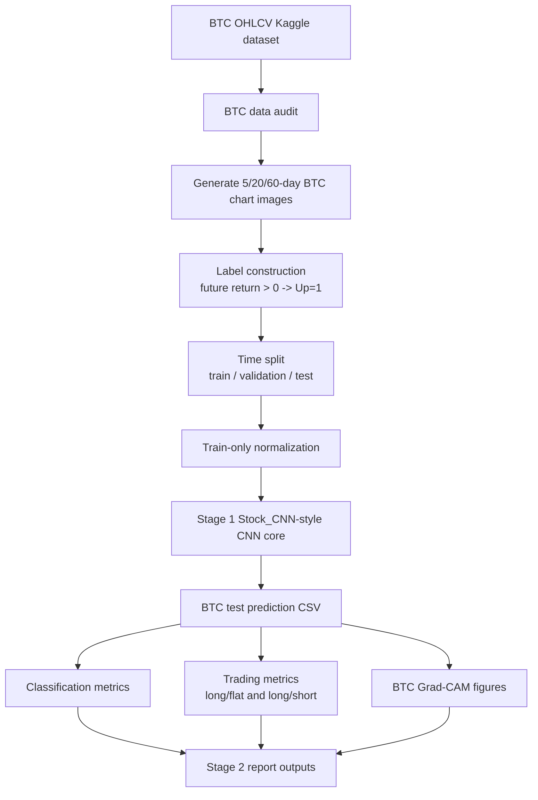
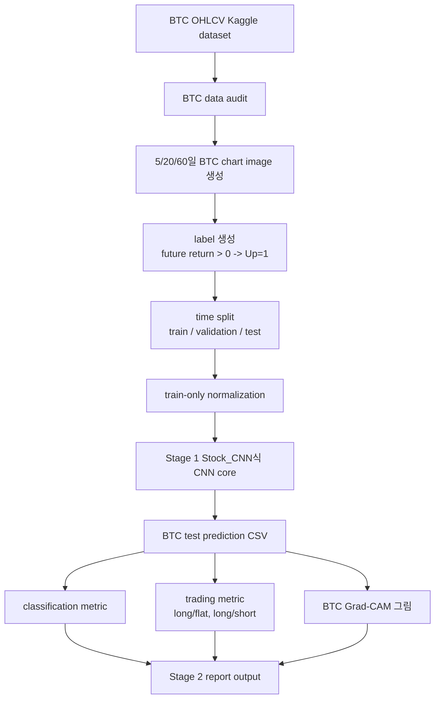

# Stage 2 Workflow Diagram

## English

Stage 2 starts from BTC data preparation. Final comparisons against Stage 1 are
blocked until Stage 1 Kaggle full outputs exist.

## 한국어

Stage 2는 BTC 데이터 준비부터 시작합니다. Stage 1 Kaggle full output이 나오기 전까지
Stage 1과의 최종 비교는 보류합니다.
