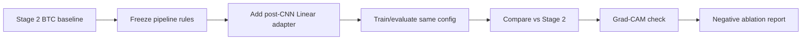

# Stage 3: Linear Adapter Ablation

Stage 3는 Stage 2 BTC visual baseline에 단순 Linear adapter를 붙여보는 negative/simple-parameter ablation입니다. 목적은 Stage 4 FiLM으로 가기 전에 “그냥 feature를 한 번 더 선형 변환하면 좋아지는가?”를 확인하는 것입니다.

## Goal

- Stage 2의 BTC data/image/label/split/evaluation pipeline은 고정합니다.
- Stage 2 Stock_CNN feature extractor 뒤에 Linear adapter를 추가합니다.
- Stage 2 baseline과 `CNN + Linear adapter`를 같은 설정에서 비교합니다.
- 단순 parameter 추가가 FiLM의 대체 설명이 되는지 확인합니다.

## Workflow



## Checklist And Review Links

| Step group | Purpose | Link |
| --- | --- | --- |
| Planning checklist | Goal-to-task workflow | [checklist.md](checklist.md) |
| Pipeline detail | Stage 3 flow | [docs/stage3_pipeline.md](docs/stage3_pipeline.md) |
| Stage 2 dependency review | What remains fixed from Stage 2 | [docs/stage2_dependency_baseline_review.md](docs/stage2_dependency_baseline_review.md) |
| Linear adapter design | Where the adapter is inserted | [docs/linear_adapter_design.md](docs/linear_adapter_design.md) |
| Training/evaluation plan | Comparison rule | [docs/training_evaluation_comparison_plan.md](docs/training_evaluation_comparison_plan.md) |
| Kaggle runner plan | Execution/output rule | [docs/kaggle_runner_output_plan.md](docs/kaggle_runner_output_plan.md) |

## Current Result

The first Stage 3 test used the Stage 2 best single-seed configuration:

`I60 / R20 / ohlc_ma_vb`, seed `42`, adapter dim `128`

| Model | Accuracy | Majority | ROC-AUC | Interpretation |
| --- | ---: | ---: | ---: | --- |
| Stage 2 visual baseline | 0.6031 | 0.5413 | 0.6170 | Strong single-seed baseline |
| Stage 3 Linear adapter | 0.5413 | 0.5413 | 0.5221 | Dropped to majority-class level |

Conclusion:
- The simple Linear adapter did not improve the Stage 2 visual baseline.
- This supports treating Stage 3 as a failed/negative ablation.
- Stage 4 should not be justified as “more parameters”; it needs a conditional modulation argument.

Available result tables:
- [Stage 3 smoke summary](reports/tables/stage3_smoke_summary_mean_std_results.csv)
- [Stage 3 smoke vs Stage 2](reports/tables/stage3_smoke_vs_stage2.csv)
- [Stage 3 grid dry-run summary](reports/tables/stage3_grid_dry_run_run_summary.csv)

## Code Map

| Area | Location | Role |
| --- | --- | --- |
| Config | [configs/](configs/) | Local/Kaggle path and runtime settings |
| Models | [src/stage3_linear/models/](src/stage3_linear/models/) | Linear adapter model |
| Interpretability | [src/stage3_linear/interpretability/](src/stage3_linear/interpretability/) | Stage 3 Grad-CAM helpers |
| Scripts | [scripts/](scripts/) | Train, evaluate, compare, summarize |
| Kaggle cells | [notebooks/](notebooks/) | Single config, grid, result viewer |
| Reports | [reports/](reports/) | Tables and smoke summaries |

## Folder Structure

```text
stage3_linear_adapter/
├── checklist.md
├── checklist_results/
├── configs/
├── docs/
├── notebooks/
├── reports/
├── scripts/
└── src/stage3_linear/
```

## Stage 4 Dependency

Stage 3 is not a required architecture dependency for Stage 4. It is kept as a comparison point showing that the thesis should focus on context-conditioned modulation rather than simple post-CNN Linear expansion.
