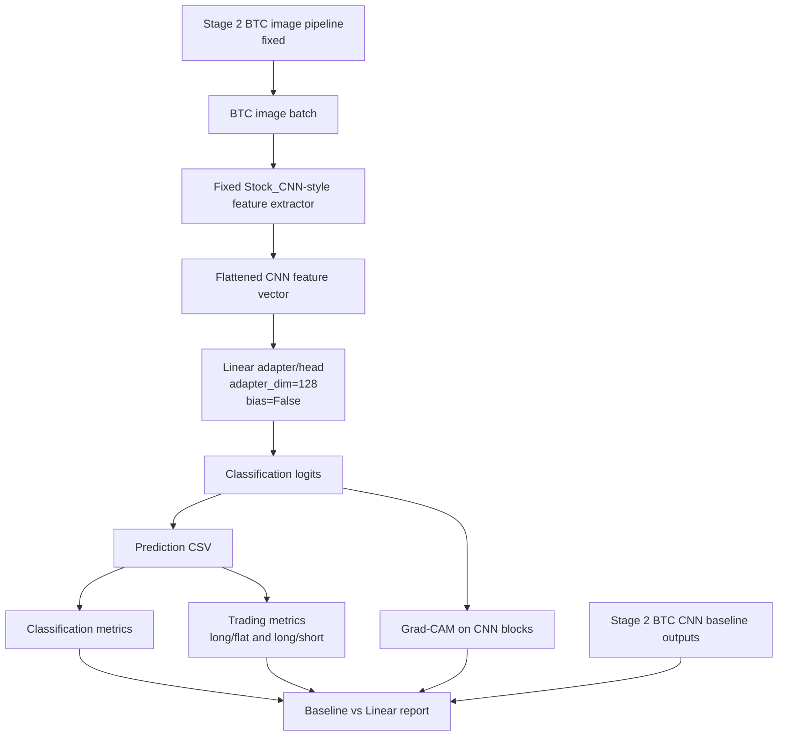
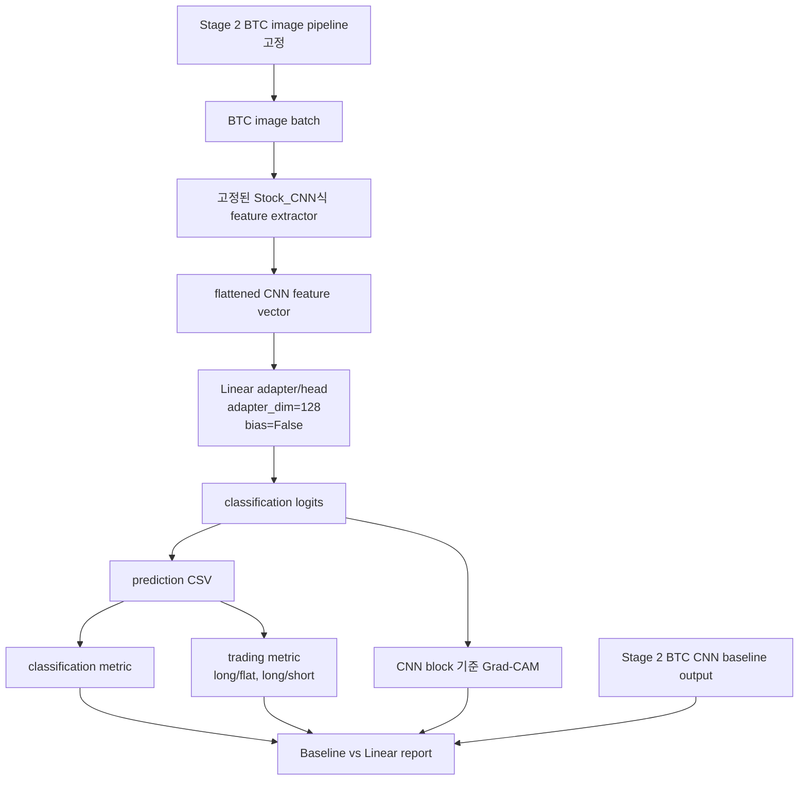

# Stage 3 Workflow Diagram

## English

Stage 3 changes only the model head/adaptation path. The BTC image, label,
split, normalization, and metric definitions remain inherited from Stage 2.
The first planned run is `I60/R20/ohlc_ma_vb`, seed `42`, followed by the
single-seed `36`-run grid.

## 한국어

Stage 3에서 바꾸는 것은 model head/adaptation path뿐입니다. BTC image, label,
split, normalization, metric 정의는 Stage 2에서 그대로 가져옵니다. 첫 실행은
`I60/R20/ohlc_ma_vb`, seed `42`이고, 이후 single-seed `36`-run grid로 갑니다.
