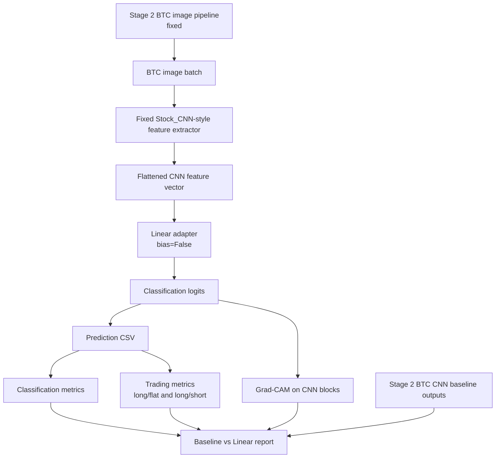
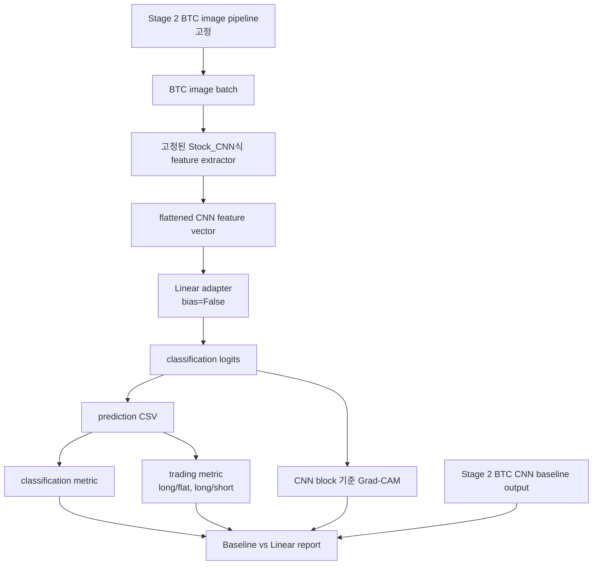

# Stage 3 Workflow Diagram

## English

Stage 3 changes only the model head/adaptation path. The BTC image, label,
split, normalization, and metric definitions remain inherited from Stage 2.

## 한국어

Stage 3에서 바꾸는 것은 model head/adaptation path뿐입니다. BTC image, label,
split, normalization, metric 정의는 Stage 2에서 그대로 가져옵니다.
