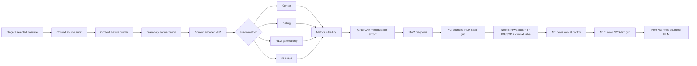

# Stage 4: Market Context Conditioning

Stage 4는 Stage 2에서 가장 안정적이었던 BTC chart-image CNN baseline에 market context를 붙이는 단계입니다. 핵심 질문은 “이미 강한 chart CNN에 시장 맥락을 어떻게 붙이면 성능과 해석력이 좋아지는가?”입니다.

## Goal

- Stage 2의 BTC image/label/split/evaluation pipeline을 유지합니다.
- Primary visual baseline은 `I60/R20/ohlc_ma_vb`입니다.
- Market context를 이미지에 직접 그리지 않고 별도 numeric/news context vector로 입력합니다.
- `concat`, `gating`, `FiLM gamma-only`, `FiLM full`을 비교합니다.
- 단순 context 추가가 아니라 FiLM의 conditional modulation과 해석 가능성을 검증합니다.

## Workflow



## Checklist And Review Links

| Step group | Purpose | Link |
| --- | --- | --- |
| Planning checklist | Goal-to-task workflow | [checklist.md](checklist.md) |
| Pipeline detail | Stage 4 flow | [docs/stage4_pipeline.md](docs/stage4_pipeline.md) |
| Professor direction brief | Why context + FiLM is the direction | [docs/professor_meeting_stage4_direction_brief.md](docs/professor_meeting_stage4_direction_brief.md) |
| FiLM insertion design | Where concat/gating/FiLM are attached | [docs/film_insertion_design.md](docs/film_insertion_design.md) |
| Context/news plan | Structured context and future news track | [docs/condition_track_plan.md](docs/condition_track_plan.md), [docs/news_context_plan.md](docs/news_context_plan.md) |
| v1 interpretation report | Five-seed v1 interpretation | [reports/stage4_v1_interpretation/stage4_v1_interpretation_report.md](reports/stage4_v1_interpretation/stage4_v1_interpretation_report.md) |

## How To Read This Folder

- Start with [checklist.md](checklist.md). The top `Active work view` shows the
  current conclusion and the next task; the lower sections preserve the full
  Stage 4 history.
- Use [checklist_results/](checklist_results/) for short per-step decisions and
  result notes.
- Use [notebooks/](notebooks/) only for Kaggle execution cells.
- Use [scripts/](scripts/) and [src/stage4_film/](src/stage4_film/) for active
  implementation.
- Local raw data, Kaggle outputs, and downloaded result bundles are kept outside
  the active code path and should not be treated as source code.

## Context Features

Primary structured context vector:

| Group | Features |
| --- | --- |
| Fear and Greed | `fg_value`, `fg_mean_60`, `fg_delta_60`, `fg_std_60` |
| Technical context | `bb_percent_b_60`, `bb_bandwidth_60`, `mfi_60`, `rv_60` |

Rules:
- Context is available only at or before image end date `t`.
- Context is normalized with train-only imputation, clipping, and z-score statistics.
- Structured numeric context was tested first.
- News context is now the active second-phase track after V9.

## Model Variants

| Track | Model | Insertion point | Purpose |
| --- | --- | --- | --- |
| `4-A` | CNN + context concat | After CNN flatten feature | Tests simple side-information fusion |
| `4-B` | CNN + context gating | Final CNN feature map | Tests multiplicative modulation |
| `4-C` | CNN + FiLM gamma-only | After BatchNorm, before LeakyReLU | Tests context-based scaling |
| `4-D` | CNN + FiLM full | After BatchNorm, before LeakyReLU | Main FiLM model: scaling + shift |

## Current Results

Reference Stage 2 baseline:

| Model | Setting | Accuracy mean | ROC-AUC mean | Status |
| --- | --- | ---: | ---: | --- |
| Stage 2 visual baseline | `I60/R20/ohlc_ma_vb`, selected five-seed | 0.5793 | 0.5849 | current strongest visual baseline |

Stage 4 v1:

| Method | Setting | Accuracy mean | ROC-AUC mean | Interpretation |
| --- | --- | ---: | ---: | --- |
| `film_full` | `I60/R20/ohlc_ma_vb` + all context, five seeds | 0.5510 | 0.5677 | Best v1 method, but below Stage 2 and unstable |

Stage 4 v2 diagnostic summary:

| ID | Experiment | Key result | Review link |
| --- | --- | --- | --- |
| `4-V0` | `ohlc_ma_vb`, visual-only same split | Reproduces the Stage 2 seed-42 baseline | [review](checklist_results/4-V0_stage4_v2_visual_only_same_split.md) |
| `4-V1` | `ohlc`, visual-only | Accuracy `0.5420`; confirms OHLC-only is much weaker than `ohlc_ma_vb` | [review](checklist_results/4-V1_stage4_v2_ohlc_visual_only.md) |
| `4-V2` | `ohlc` + all context + `film_full`, seed 42 | Accuracy `0.5725`; partial recovery over OHLC-only | [review](checklist_results/4-V2_stage4_v2_ohlc_all_context_film_full.md) |
| `4-V3` | `ohlc` + F&G-only + `film_full`, five seeds | Accuracy mean `0.5586`; F&G alone is not enough | [review](checklist_results/4-V3_stage4_v2_ohlc_fg_only_film_full.md) |
| `4-V4` | `ohlc` + technical-only + `film_full`, five seeds | Accuracy mean `0.5603`; technical context is also weak alone | [review](checklist_results/4-V4_stage4_v2_ohlc_technical_only_film_full.md) |
| `4-V5` | `ohlc` + all context + `film_full`, five seeds | Accuracy mean `0.5574`; seed-42 gain is not robust | [review](checklist_results/4-V5_stage4_v2_ohlc_all_context_five_seed.md) |
| `4-V6` | `ohlc_ma_vb` + F&G-only + `film_full`, five seeds | Accuracy mean `0.5524`; full FiLM still unstable on strong visual baseline | [review](checklist_results/4-V6_stage4_v2_ohlc_ma_vb_fg_only_five_seed.md) |
| `4-V7` | `ohlc_ma_vb` + F&G-only + bounded last-block FiLM, five seeds | Accuracy mean `0.5425`; ROC-AUC mean `0.5763`; ranking improved but seeds `43`/`44` collapsed mostly Down | [review](checklist_results/4-V7_stage4_v2_bounded_residual_last_block_film.md) |
| `4-V8` | P7/P8 seed-collapse diagnostic | Validation-threshold calibration alone did not solve collapse; P8 FiLM scale needs controlled testing | [review](checklist_results/4-V8_stage4_v2_p7_p8_seed_collapse_diagnostic.md) |
| `4-V9` | bounded last-block FiLM scale grid | Accuracy stayed below Stage 2 for all scales; lower scale reduced some collapse, but seed `44` collapsed for every scale | [review](checklist_results/4-V9_stage4_v2_bounded_last_block_film_scale_grid.md) |

Current interpretation:
- `ohlc_ma_vb` already contains strong visual/technical information.
- Re-injecting overlapping technical context through full FiLM often adds noise.
- F&G is image-external context, but full FiLM still causes seed instability.
- Next architecture work should preserve the strong visual path more explicitly.

News-context track:

| ID | Experiment | Status | Review link |
| --- | --- | --- | --- |
| `4-N1`-`4-N5` | headline-only BTC news audit, strict `t-1` alignment, 7/20/60 headline windows, train-only TF-IDF/SVD, sample-level `102`-dim context table | Completed | [N5 review](checklist_results/4-N5_news_context_feature_builder.md) |
| `4-N6` | `I60/R20/ohlc_ma_vb` + `CNN + news concat`, SVD dim `32`, five seeds | Accuracy mean `0.5478`, ROC-AUC mean `0.5644`; seeds `43`/`45` collapsed | [N6 review](checklist_results/4-N6_news_context_baseline_controls.md) |
| `4-N6.1` | Same `CNN + news concat`, SVD dim grid `16`, `8` | Prepared for Kaggle; checks whether lower-dimensional news vectors reduce collapse before FiLM | [N6.1 review](checklist_results/4-N6.1_news_svd_dim_grid.md) |

Next direction:
- close the structured F&G-only track as a negative/unstable result for the
  main claim;
- continue the news-context track using headline-only, strict `t-1`,
  train-only TF-IDF/SVD vectors; the first `102`-dimensional N6 vector was
  unstable, so N6.1 tests smaller dimensions;
- reduce the news SVD dimension if the first concat control collapses;
- run `CNN + news bounded last-block FiLM` only after choosing the most stable
  news vector size, then consider F&G or LLM summaries.

## Code Map

| Area | Location | Role |
| --- | --- | --- |
| Config | [configs/](configs/) | Local/Kaggle path and runtime settings |
| Context features | [src/stage4_film/context/](src/stage4_film/context/) | F&G/OHLCV-derived feature construction |
| Context encoder | [src/stage4_film/conditions/](src/stage4_film/conditions/) | MLP condition embedding |
| FiLM layers | [src/stage4_film/layers/](src/stage4_film/layers/) | FiLM affine modulation and generator |
| Models | [src/stage4_film/models/](src/stage4_film/models/) | concat/gating/FiLM context Stock_CNN variants |
| Training | [src/stage4_film/training/](src/stage4_film/training/) | Context model training loop |
| Evaluation | [src/stage4_film/evaluation/](src/stage4_film/evaluation/) | Prediction/trading metric helpers |
| Interpretability | [src/stage4_film/interpretability/](src/stage4_film/interpretability/) | Grad-CAM and modulation export |
| Runners | [scripts/](scripts/) | Audit, build context, train, evaluate, export |
| Kaggle cells | [notebooks/](notebooks/) | v1/v2 experiment runners |

## Folder Structure

```text
stage4_film_conditioning/
├── FG_data/                  # local raw F&G data, not tracked
├── checklist.md
├── checklist_results/
├── configs/
├── docs/
├── notebooks/
├── outputs/                  # local/Kaggle outputs, not source code
├── reports/
├── scripts/
├── stage4_p7_p8_result_bundle/ # downloaded analysis bundle, local result data
└── src/stage4_film/
```

## Thesis Position

Stage 4 should be presented as an interpretability and conditional-modulation experiment, not as a simple feature-adding experiment. The strongest current conclusion is that structured F&G-only numeric context is not robust enough, so the next defensible step is richer external news context with strict no-leakage alignment.
