# Stage 4: Market Context Conditioning

Stage 4는 Stage 2에서 가장 안정적이었던 BTC chart-image CNN baseline에 market context를 붙이는 단계입니다. 핵심 질문은 “이미 강한 chart CNN에 시장 맥락을 어떻게 붙이면 성능과 해석력이 좋아지는가?”입니다.

## Goal

- Stage 2의 BTC image/label/split/evaluation pipeline을 유지합니다.
- Primary visual baseline은 `I60/R20/ohlc_ma_vb`입니다.
- Market context를 이미지에 직접 그리지 않고 별도 numeric/news context vector로 입력합니다.
- `concat`, `gating`, `FiLM gamma-only`, `FiLM full`을 비교합니다.
- 단순 context 추가가 아니라 FiLM의 conditional modulation과 해석 가능성을 검증합니다.

## Workflow

```mermaid
flowchart LR
    A[Stage 2 selected baseline] --> B[Context source audit]
    B --> C[Context feature builder]
    C --> D[Train-only normalization]
    D --> E[Context encoder MLP]
    E --> F{Fusion method}
    F --> F1[Concat]
    F --> F2[Gating]
    F --> F3[FiLM gamma-only]
    F --> F4[FiLM full]
    F1 --> G[Metrics + trading]
    F2 --> G
    F3 --> G
    F4 --> G
    G --> H[Grad-CAM + modulation export]
    H --> I[v1/v2 diagnosis]
    I --> J[V9: bounded FiLM scale grid]
    J --> K[N0-N5: news audit + TF-IDF/SVD + context table]
    K --> L[N6: news concat control]
    L --> M[N6.1: news SVD-dim grid]
    M --> N[N7: SVD8 news bounded FiLM]
    N --> O[N8: Stage2 pretrained/frozen FiLM]
    O --> P[N9/N10: news pretrained/frozen + interpretation]
    P --> Q[N12-A/B/C/D: gated FiLM + context-source comparison]
    Q --> R[N13-0/1: FSI/RORO source audit + FSI features]
    R --> S[N13-2/4: FSI-only and RORO-proxy-only FiLM]
    S --> T[N13-5/6: macro comparison + interpretability]
    T --> U[N15: image-spec context-complement checks]
    U --> V[N16: derivatives/leverage context]
    V --> W[N14: final Stage 4 report]
```



## Checklist And Review Links

| Step group | Purpose | Link |
| --- | --- | --- |
| Planning checklist | Goal-to-task workflow | [checklist.md](checklist.md) |
| Pipeline detail | Stage 4 flow | [docs/stage4_pipeline.md](docs/stage4_pipeline.md) |
| Professor direction brief | Why context + FiLM is the direction | [docs/professor_meeting_stage4_direction_brief.md](docs/professor_meeting_stage4_direction_brief.md) |
| FiLM insertion design | Where concat/gating/FiLM are attached | [docs/film_insertion_design.md](docs/film_insertion_design.md) |
| Context/news plan | Structured context and future news track | [docs/condition_track_plan.md](docs/condition_track_plan.md), [docs/news_context_plan.md](docs/news_context_plan.md) |
| v1 interpretation report | Five-seed v1 interpretation | [reports/stage4_v1_interpretation/stage4_v1_interpretation_report.md](reports/stage4_v1_interpretation/stage4_v1_interpretation_report.md) |
| Derivatives/leverage context | BitMEX funding/activity and CFTC/CME OI plan | [checklist_results/4-N16_derivatives_leverage_context_plan.md](checklist_results/4-N16_derivatives_leverage_context_plan.md), [data inventory](data_inventory/crypto_derivatives/README.md) |

## How To Read This Folder

- Start with [checklist.md](checklist.md). The top `Active work view` shows the
  current conclusion and the next task; the lower sections preserve the full
  Stage 4 history.
- Use [checklist_results/](checklist_results/) for short per-step decisions and
  result notes.
- Use [notebooks/](notebooks/) only for Kaggle execution cells.
- Use [scripts/](scripts/) and [src/stage4_film/](src/stage4_film/) for active
  implementation.
- Local raw data, Kaggle outputs, and downloaded result bundles are kept outside
  the active code path and should not be treated as source code.

## Context Features

Primary structured context vector:

| Group | Features |
| --- | --- |
| Fear and Greed | `fg_value`, `fg_mean_60`, `fg_delta_60`, `fg_std_60` |
| Technical context | `bb_percent_b_60`, `bb_bandwidth_60`, `mfi_60`, `rv_60` |
| Derivatives/leverage | BitMEX funding/activity; release-lagged CFTC/CME open interest and positioning |

Rules:
- Context is available only at or before image end date `t`.
- Context is normalized with train-only imputation, clipping, and z-score statistics.
- Structured numeric context was tested first.
- News, macro/RORO, technical, F&G, and derivatives/leverage context have all
  been tested under the current Stage 4 scope; N14 closes this cycle for
  professor/thesis reporting.

## Model Variants

| Track | Model | Insertion point | Purpose |
| --- | --- | --- | --- |
| `4-A` | CNN + context concat | After CNN flatten feature | Tests simple side-information fusion |
| `4-B` | CNN + context gating | Final CNN feature map | Tests multiplicative modulation |
| `4-C` | CNN + FiLM gamma-only | After BatchNorm, before LeakyReLU | Tests context-based scaling |
| `4-D` | CNN + FiLM full | After BatchNorm, before LeakyReLU | Main FiLM model: scaling + shift |

## Current Results

Reference Stage 2 baseline:

| Model | Setting | Accuracy mean | ROC-AUC mean | Status |
| --- | --- | ---: | ---: | --- |
| Stage 2 visual baseline | `I60/R20/ohlc_ma_vb`, selected five-seed | 0.5793 | 0.5849 | current strongest visual baseline |

Stage 4 v1:

| Method | Setting | Accuracy mean | ROC-AUC mean | Interpretation |
| --- | --- | ---: | ---: | --- |
| `film_full` | `I60/R20/ohlc_ma_vb` + all context, five seeds | 0.5510 | 0.5677 | Best v1 method, but below Stage 2 and unstable |

Stage 4 v2 diagnostic summary:

| ID | Experiment | Key result | Review link |
| --- | --- | --- | --- |
| `4-V0` | `ohlc_ma_vb`, visual-only same split | Reproduces the Stage 2 seed-42 baseline | [review](checklist_results/4-V0_stage4_v2_visual_only_same_split.md) |
| `4-V1` | `ohlc`, visual-only | Accuracy `0.5420`; confirms OHLC-only is much weaker than `ohlc_ma_vb` | [review](checklist_results/4-V1_stage4_v2_ohlc_visual_only.md) |
| `4-V2` | `ohlc` + all context + `film_full`, seed 42 | Accuracy `0.5725`; partial recovery over OHLC-only | [review](checklist_results/4-V2_stage4_v2_ohlc_all_context_film_full.md) |
| `4-V3` | `ohlc` + F&G-only + `film_full`, five seeds | Accuracy mean `0.5586`; F&G alone is not enough | [review](checklist_results/4-V3_stage4_v2_ohlc_fg_only_film_full.md) |
| `4-V4` | `ohlc` + technical-only + `film_full`, five seeds | Accuracy mean `0.5603`; technical context is also weak alone | [review](checklist_results/4-V4_stage4_v2_ohlc_technical_only_film_full.md) |
| `4-V5` | `ohlc` + all context + `film_full`, five seeds | Accuracy mean `0.5574`; seed-42 gain is not robust | [review](checklist_results/4-V5_stage4_v2_ohlc_all_context_five_seed.md) |
| `4-V6` | `ohlc_ma_vb` + F&G-only + `film_full`, five seeds | Accuracy mean `0.5524`; full FiLM still unstable on strong visual baseline | [review](checklist_results/4-V6_stage4_v2_ohlc_ma_vb_fg_only_five_seed.md) |
| `4-V7` | `ohlc_ma_vb` + F&G-only + bounded last-block FiLM, five seeds | Accuracy mean `0.5425`; ROC-AUC mean `0.5763`; ranking improved but seeds `43`/`44` collapsed mostly Down | [review](checklist_results/4-V7_stage4_v2_bounded_residual_last_block_film.md) |
| `4-V8` | P7/P8 seed-collapse diagnostic | Validation-threshold calibration alone did not solve collapse; P8 FiLM scale needs controlled testing | [review](checklist_results/4-V8_stage4_v2_p7_p8_seed_collapse_diagnostic.md) |
| `4-V9` | bounded last-block FiLM scale grid | Accuracy stayed below Stage 2 for all scales; lower scale reduced some collapse, but seed `44` collapsed for every scale | [review](checklist_results/4-V9_stage4_v2_bounded_last_block_film_scale_grid.md) |

Current interpretation:
- `ohlc_ma_vb` already contains strong visual/technical information.
- Re-injecting overlapping technical context through full FiLM often adds noise.
- F&G is image-external context, but full FiLM still causes seed instability.
- Baseline-preserving frozen Stage 2 + bounded final-block FiLM is the most
  stable protocol, but most context sources produce only small corrections.

News-context track:

| ID | Experiment | Status | Review link |
| --- | --- | --- | --- |
| `4-N1`-`4-N5` | headline-only BTC news audit, strict `t-1` alignment, 7/20/60 headline windows, train-only TF-IDF/SVD, sample-level `102`-dim context table | Completed | [N5 review](checklist_results/4-N5_news_context_feature_builder.md) |
| `4-N6` | `I60/R20/ohlc_ma_vb` + `CNN + news concat`, SVD dim `32`, five seeds | Accuracy mean `0.5478`, ROC-AUC mean `0.5644`; seeds `43`/`45` collapsed | [N6 review](checklist_results/4-N6_news_context_baseline_controls.md) |
| `4-N6.1` | Same `CNN + news concat`, SVD dim grid `16`, `8` | SVD8 selected: accuracy mean `0.5407`, ROC-AUC mean `0.5817`; ranking signal strongest but seeds `45`/`46` collapsed Down | [N6.1 review](checklist_results/4-N6.1_news_svd_dim_grid.md) |
| `4-N7` | SVD8 news vector + bounded last-block FiLM, scale `0.05` | Prepared for Kaggle; tests whether FiLM can stabilize/use the SVD8 news signal | [N7 review](checklist_results/4-N7_news_bounded_film_svd8.md) |
| `4-N8-B` | Stage 2 checkpoint loaded/frozen + F&G-only bounded FiLM | Baseline-preserving structure works; scale `0.02` accuracy mean `0.5803`, ROC-AUC mean `0.5849` | [N8 review](checklist_results/4-N8_pretrained_baseline_preserving_film.md) |
| `4-N9/N10` | Stage 2 checkpoint loaded/frozen + news TF-IDF/SVD bounded FiLM | N10 news SVD32/scale `0.02` is the current news-only comparison; targeted correction analysis and Grad-CAM export are prepared | [N10 review](checklist_results/4-N10_news_interpretability_report.md), [N10-B review](checklist_results/4-N10-B_targeted_gradcam_modulation_export.md) |
| `4-N12-A` | Stage 2 checkpoint loaded/frozen + uncertainty-gated news FiLM | Completed; essentially tied with Stage 2 on accuracy, tiny ROC-AUC lift, useful as diagnostic rather than final claim | [N12-A review](checklist_results/4-N12-A_uncertainty_gated_news_film.md) |
| `4-N12-B` | Stage 2 checkpoint loaded/frozen + confidence-gated news FiLM | Completed; class decisions match Stage 2 exactly, ROC-AUC moves only minimally | [N12-B review](checklist_results/4-N12-B_confidence_gated_news_film.md) |
| `4-N12-C` | Stage 2 checkpoint loaded/frozen + technical-only bounded FiLM | Completed; scale `0.02` accuracy mean `0.5797`, ROC-AUC `0.5848`, effectively tied with Stage 2 | [N12-C review](checklist_results/4-N12-C_technical_only_pretrained_frozen_bounded_film.md) |
| `4-N12-D` | Frozen Stage 2 context-source comparison | Completed for existing sources; F&G-only is the best compact accuracy candidate, news improves ROC-AUC/Brier more than hard decisions, and technical-only is mostly redundant | [N12-D review](checklist_results/4-N12-D_context_source_comparison.md), [table](reports/tables/stage4_n12d_context_source_comparison_compact.csv) |
| `4-N13-0/1` | Macro/RORO source audit + OFR FSI feature builder | Completed; OFR FSI context artifact built with six train-normalized risk-off proxy features; screening selected compact `FSI-2` and `FSI-3` candidates | [N13-1 result](checklist_results/4-N13-1_ofr_fsi_feature_builder.md), [screening](checklist_results/4-N13-1_fsi_feature_screening.md), [audit](reports/tables/stage4_fsi_context_i60_ohlc_ma_vb_r20_ofr_fsi_lag1_w20_60_seed42_fsi_context_feature_audit.json) |
| `4-N13-2` | FSI-only frozen bounded FiLM | Completed; best FSI row `fsi_all` accuracy `0.5799`, ROC-AUC `0.5849`, net correction `+4`, zero collapse; stable but not materially stronger than Stage 2/N8-B F&G | [N13-2 result](checklist_results/4-N13-2_fsi_only_pretrained_frozen_bounded_film.md), [comparison](reports/tables/stage4_n13_2_with_prior_context_comparison_compact.csv) |
| `4-N13-3/4` | KC Fed-inspired public-data RORO proxy + FiLM | Completed; N13-3 artifact built from cached VIX, S&P500, DXY, and US 10Y sources; N13-4 RORO-only five-seed run had zero collapse but only tied Stage 2: best row `roro_3` accuracy `0.5793`, ROC-AUC `0.5847` | [N13-3 builder](checklist_results/4-N13-3_public_roro_proxy_builder.md), [N13-4 result](checklist_results/4-N13-4_roro_proxy_only_pretrained_frozen_bounded_film.md), [N13-4 table](reports/tables/stage4_n13_4_roro_only_pretrained_frozen_bounded_film_mean_std_results.csv), [N13-4 Kaggle cell](notebooks/kaggle_stage4_n13_4_roro_only_pretrained_frozen_bounded_film_one_cell.md) |
| `4-N13-5/5A/5B/6` | Macro comparison, cross-context feature audit, selected-combo FiLM, interpretability export | N13-5A completed on 2,399 aligned rows and 126 features; N13-5B selected six-feature combo tied Stage 2 accuracy (`0.5793`) with net correction `0`; N13-6 matched Stage2 vs F&G/news Grad-CAM and gamma/beta export completed for final interpretation | [N13-5 result](checklist_results/4-N13-5_macro_context_source_comparison.md), [N13-5A audit](checklist_results/4-N13-5A_cross_context_feature_audit.md), [N13-5B result](checklist_results/4-N13-5B_selected_combo_context_film.md), [N13-6 review](checklist_results/4-N13-6_interpretability_export.md), [N13-6 Kaggle cell](notebooks/kaggle_stage4_n13_6_interpretability_export_one_cell.md) |
| `4-N13-7A` | F&G bounded FiLM scale ablation | Completed. Larger scales `0.10/0.20` did not improve N8-B `0.02`: accuracy means `0.5790/0.5785`, ROC-AUC `0.5848/0.5845`, net correction `-2/-6`; no severe collapse, but extra modulation caused more regressions than corrections | [N13-7 plan](checklist_results/4-N13-7_final_film_constraint_ablation_plan.md), [N13-7A result](checklist_results/4-N13-7A_fg_bounded_scale_grid.md), [N13-7A Kaggle cell](notebooks/kaggle_stage4_n13_7a_fg_bounded_scale_grid_one_cell.md) |
| `4-N13-7D` | F&G classifier-unfreeze FiLM | Completed. Opening the classifier hurt the baseline: accuracy `0.5743`, ROC-AUC `0.5842`, Brier `0.2802`, net correction `-36`; extra flexibility caused more regressions than corrections, so N8-B `scale=0.02` remains the best F&G setting | [N13-7D result](checklist_results/4-N13-7D_fg_classifier_unfreeze.md), [N13-7D Kaggle cell](notebooks/kaggle_stage4_n13_7d_fg_classifier_unfreeze_one_cell.md) |
| `4-N13-B` | Optional sentiment/event feature extension | Deferred; only needed if headline TF-IDF/SVD remains weak or hard to interpret | [N12/N13 plan](checklist_results/4-N12_gated_film_and_context_source_plan.md) |
| `4-N15-A` | Stage 2 I60/R20 four-image checkpoint bundle | Completed and verified. `ohlc`, `ohlc_ma`, `ohlc_vb`, `ohlc_ma_vb` five-seed results exactly reproduce the existing Stage 2 table; reusable local bundle has 20 `best.pt` checkpoints plus metrics/predictions | [N15-A result](checklist_results/4-N15-A_i60_r20_stage2_four_image_checkpoint_bundle.md), [N15-A Kaggle cell](notebooks/kaggle_stage4_n15a_rebuild_i60_r20_four_image_stage2_checkpoints_one_cell.md) |
| `4-N15-B` | Image-spec context-complement FiLM | Completed. All 20 runs finished, but technical context summaries only preserved same-image Stage 2: acc deltas ranged from `0.000000` to `+0.000416`, changed-decision rates were only `0.2%`-`0.4%`; direct visual encoding remains stronger than compact technical replacement | [N15 plan](checklist_results/4-N15_i60_r20_image_spec_context_complement_plan.md), [N15-B result](checklist_results/4-N15-B_image_missing_feature_complement_film.md), [N15-B Kaggle cell](notebooks/kaggle_stage4_n15b_image_missing_feature_complement_film_one_cell.md) |
| `4-N15-C` | F&G-only across image specs | Completed. F&G-only frozen bounded FiLM was tested across all four I60/R20 image specs. Same-image deltas were small: `ohlc` -0.0004, `ohlc_ma` -0.0008, `ohlc_vb` +0.0006, `ohlc_ma_vb` +0.0010; volume-aware specs show the only positive but still weak effect | [N15-C result](checklist_results/4-N15-C_fg_only_across_image_specs.md), [N15-C Kaggle cell](notebooks/kaggle_stage4_n15c_fg_only_across_image_specs_one_cell.md) |
| `4-N16` | Derivatives/leverage context | Completed. On the strongest `ohlc_ma_vb` image this context mostly tied Stage 2, but on the weaker volume-aware `ohlc_vb` image, `funding_plus_cftc_oi` improved same-image accuracy by `+0.002082` with net `+15` corrections. N16-5 shows the FiLM head mainly suppresses weak bullish calls in higher derivatives/leverage regimes | [N16 plan](checklist_results/4-N16_derivatives_leverage_context_plan.md), [N16-4 result](checklist_results/4-N16-4_ohlc_vb_derivatives_repeat.md), [N16-5 interpretation](checklist_results/4-N16-5_derivatives_interpretability_export.md), [data inventory](data_inventory/crypto_derivatives/README.md) |
| `4-N14` | Final Stage 4 interpretability report | Completed. Summarizes Stage 2 baseline, Stage 4 negative/limited results, N16 positive same-image case, Grad-CAM/gamma-beta interpretation, and final thesis claim | [N14 report](checklist_results/4-N14_final_stage4_interpretability_report.md), [report copy](reports/tables/stage4_n14_final_stage4_interpretability_report.md) |
| `4-N14-B` | Conditional regime analysis | Completed for the N16 derivatives/leverage same-image case. Small summary/report artifacts are tracked; the large merged-decision CSV remains local/Kaggle-only. Main thesis result: uncertain chart + high funding bucket has `+0.039604` accuracy delta with `24` corrections vs `12` regressions | [N14-B plan](checklist_results/4-N14-B_conditional_regime_analysis_plan.md), [merge report](reports/tables/stage4_n14b1_n16_derivatives_conditional_merge_report.md), [bucket report](reports/tables/stage4_n14b2_b6_n16_derivatives_conditional_buckets_report.md), [bucket summary](reports/tables/stage4_n14b2_b6_n16_derivatives_conditional_buckets_bucket_summary.csv) |

Current final thesis use:
- present N16 as a small but interpretable same-image context-complement result,
  not as a new overall best model;
- use targeted Grad-CAM plus gamma/beta summaries for rows where Stage 2 is
  corrected or where derivatives/leverage context suppresses weak bullish
  predictions;
- use the completed N14-B conditional-regime summaries as supporting evidence,
  not as a new model branch.

## Code Map

| Area | Location | Role |
| --- | --- | --- |
| Config | [configs/](configs/) | Local/Kaggle path and runtime settings |
| Context features | [src/stage4_film/context/](src/stage4_film/context/) | F&G/OHLCV-derived feature construction |
| Context encoder | [src/stage4_film/conditions/](src/stage4_film/conditions/) | MLP condition embedding |
| FiLM layers | [src/stage4_film/layers/](src/stage4_film/layers/) | FiLM affine modulation and generator |
| Models | [src/stage4_film/models/](src/stage4_film/models/) | concat/gating/FiLM context Stock_CNN variants, including bounded and uncertainty-gated final-block FiLM |
| Training | [src/stage4_film/training/](src/stage4_film/training/) | Context model training loop |
| Evaluation | [src/stage4_film/evaluation/](src/stage4_film/evaluation/) | Prediction/trading metric helpers |
| Interpretability | [src/stage4_film/interpretability/](src/stage4_film/interpretability/) | Grad-CAM and modulation export |
| Runners | [scripts/](scripts/) | Audit, build context, train, evaluate, export |
| Kaggle cells | [notebooks/](notebooks/) | v1/v2 experiment runners |

## Folder Structure

```text
stage4_film_conditioning/
├── FG_data/                  # local raw F&G data, not tracked
├── checklist.md
├── checklist_results/
├── configs/
├── docs/
├── notebooks/
├── outputs/                  # local/Kaggle outputs, not source code
├── reports/
├── scripts/
├── stage4_p7_p8_result_bundle/ # downloaded analysis bundle, local result data
└── src/stage4_film/
```

## Thesis Position

Stage 4 should be presented as an interpretability and conditional-modulation experiment, not as a simple feature-adding experiment. The strongest current conclusion is that frozen Stage 2 + bounded context-FiLM preserves the visual baseline, but completed context sources produce only tiny improvements. F&G-only is the best compact accuracy candidate on the strongest image baseline; news is more useful for ranking/calibration; chart-derived technical context is mostly redundant. The most useful positive case is N16 `ohlc_vb + funding_plus_cftc_oi`, which gives a small same-image improvement and an interpretable bearish correction pattern in higher derivatives/leverage regimes.
