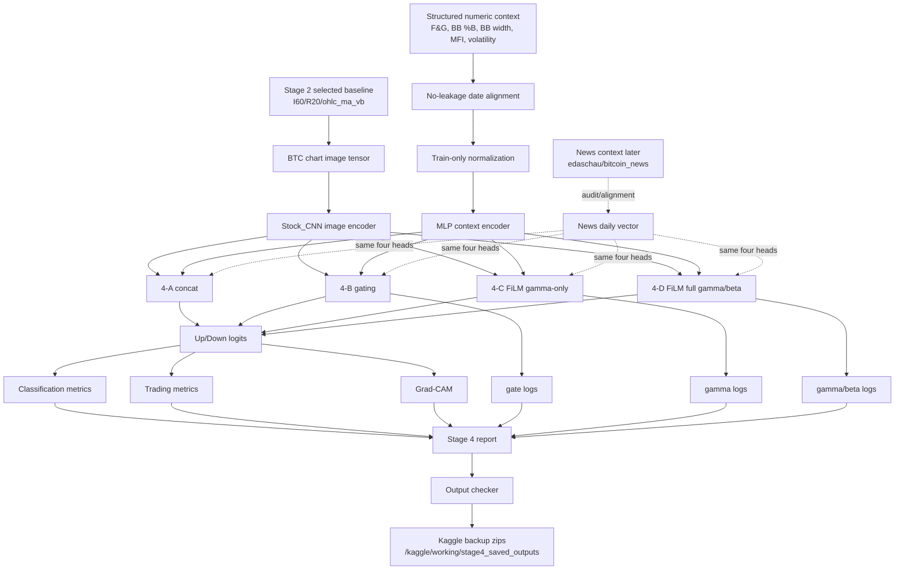

# Stage 4 Workflow Diagram

## English

```mermaid
flowchart TD
    A[Stage 2 selected baseline<br/>I60/R20/ohlc_ma_vb] --> B[BTC chart image tensor]
    B --> C[Stock_CNN image encoder]

    D[Structured numeric context<br/>F&G, BB %B, BB width, MFI, volatility] --> E[No-leakage date alignment]
    E --> F[Train-only normalization]
    F --> G[MLP context encoder]

    C --> H1[4-A concat]
    G --> H1
    H1 --> O[Up/Down logits]

    C --> H2[4-B gating]
    G --> H2
    H2 --> O

    C --> H3[4-C FiLM gamma-only]
    G --> H3
    H3 --> O

    C --> H4[4-D FiLM full gamma/beta]
    G --> H4
    H4 --> O

    O --> M1[Classification metrics]
    O --> M2[Trading metrics]
    O --> M3[Grad-CAM]
    H2 --> L1[gate logs]
    H3 --> L2[gamma logs]
    H4 --> L3[gamma/beta logs]
    M1 --> R[Stage 4 report]
    M2 --> R
    M3 --> R
    L1 --> R
    L2 --> R
    L3 --> R
    R --> OC[Output checker]
    OC --> BK[Kaggle backup zips<br/>/kaggle/working/stage4_saved_outputs]

    N[News context later<br/>edaschau/bitcoin_news] -. audit/alignment .-> NG[News daily vector]
    NG -. same four heads .-> H1
    NG -. same four heads .-> H2
    NG -. same four heads .-> H3
    NG -. same four heads .-> H4
```

## 한국어

```mermaid
flowchart TD
    A[Stage 2 selected baseline<br/>I60/R20/ohlc_ma_vb] --> B[BTC chart image tensor]
    B --> C[Stock_CNN image encoder]

    D[Structured numeric context<br/>F&G, BB %B, BB width, MFI, volatility] --> E[No-leakage date alignment]
    E --> F[Train-only normalization]
    F --> G[MLP context encoder]

    C --> H1[4-A concat]
    G --> H1
    H1 --> O[Up/Down logits]

    C --> H2[4-B gating]
    G --> H2
    H2 --> O

    C --> H3[4-C FiLM gamma-only]
    G --> H3
    H3 --> O

    C --> H4[4-D FiLM full gamma/beta]
    G --> H4
    H4 --> O

    O --> M1[Classification metrics]
    O --> M2[Trading metrics]
    O --> M3[Grad-CAM]
    H2 --> L1[gate logs]
    H3 --> L2[gamma logs]
    H4 --> L3[gamma/beta logs]
    M1 --> R[Stage 4 report]
    M2 --> R
    M3 --> R
    L1 --> R
    L2 --> R
    L3 --> R
    R --> OC[Output checker]
    OC --> BK[Kaggle backup zips<br/>/kaggle/working/stage4_saved_outputs]

    N[News context later<br/>edaschau/bitcoin_news] -. audit/alignment .-> NG[News daily vector]
    NG -. same four heads .-> H1
    NG -. same four heads .-> H2
    NG -. same four heads .-> H3
    NG -. same four heads .-> H4
```
