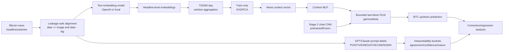
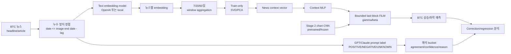

# Stage 5 Workflow Diagram

## English

```mermaid
flowchart LR
    N[Bitcoin news<br/>headlines/articles]
    A[Leakage-safe alignment<br/>date <= image end date - lag]
    E[Text embedding model<br/>OpenAI or local]
    H[Headline-level embeddings]
    W[7/20/60-day<br/>window aggregation]
    D[Train-only<br/>SVD/PCA]
    C[News context vector]
    M[Context MLP]
    F[Bounded last-block FiLM<br/>gamma/beta]
    V[Stage 2 chart CNN<br/>pretrained/frozen]
    Y[BTC up/down prediction]

    N --> A --> E --> H --> W --> D --> C --> M --> F
    V --> F --> Y

    P[GPT/Claude prompt labels<br/>POSITIVE/NEGATIVE/UNKNOWN]
    A --> P
    P --> I[Interpretability buckets<br/>agreement/confidence/reason]
    Y --> R[Correction/regression analysis]
    I --> R
```

## 한국어

```mermaid
flowchart LR
    N[BTC 뉴스<br/>headline/article]
    A[누수 방지 정렬<br/>date <= image end date - lag]
    E[Text embedding model<br/>OpenAI 또는 local]
    H[뉴스별 embedding]
    W[7/20/60일<br/>window aggregation]
    D[Train-only<br/>SVD/PCA]
    C[News context vector]
    M[Context MLP]
    F[Bounded last-block FiLM<br/>gamma/beta]
    V[Stage 2 chart CNN<br/>pretrained/frozen]
    Y[BTC 상승/하락 예측]

    N --> A --> E --> H --> W --> D --> C --> M --> F
    V --> F --> Y

    P[GPT/Claude prompt label<br/>POSITIVE/NEGATIVE/UNKNOWN]
    A --> P
    P --> I[해석 bucket<br/>agreement/confidence/reason]
    Y --> R[Correction/regression 분석]
    I --> R
```

